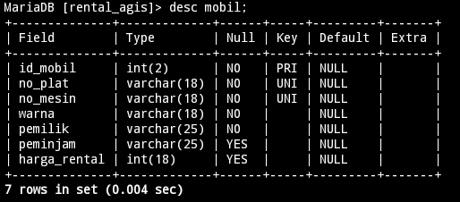
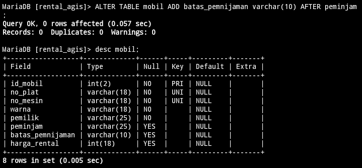
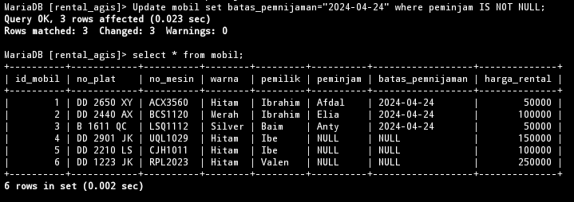
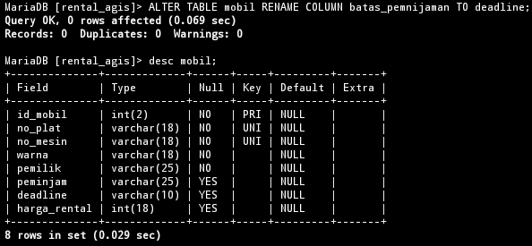
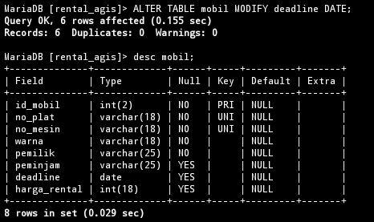
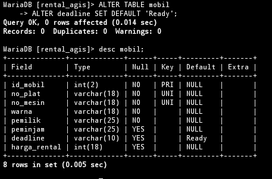

# Menambahkan kolom
## Struktur
## Contoh
```sql
ALTER TABLE mobil ADD batas_pemnijaman varchar(10) AFTER peminjam;
```
## Hasil
### Before

### After

## Analisis
## Kesimpulan
## Tambahan

# Mengubah nama kolom
## Struktur 
## Contoh
```sql
ALTER TABLE mobil RENAME COLUMN batas_pemnijaman TO deadline;
```
## Hasil

## Analisis
## Kesimpulan
# Mengubah tipe data kolom
## Struktur 
## Contoh
```sql
ALTER TABLE mobil MODIFY deadline DATE;
```
## Hasil

## Analisis
## Kesimpulan
# Menambahkan Constraint
## Struktur 
## Contoh
```sql
ALTER TABLE mobil
ALTER deadline SET DEFAULT 'Ready';
```
## Hasil

## Analisis
## Kesimpulan
