# Pengenalan Basis Data
## Definisi Basis Data
**Basis** : Adalah tempat berkumpul, markas, gudang, wadah suatu data.

**Data** : Adalah sekumpulan fakta sebuah objek.

**Kesimpulan** : **Basis data** adalah kumpulan informasi yg disimpan di dalam komputer secara sistematik.
## Peranan Basis Data
**Lembaga Indomaret** : menggunakan sistem basis data untuk mencatat data karyawan, kode barang, harga barang, kasir, isi barang, tempat barang. Jika melakukan transaksi ada Kasir yg melakukan transaksi dengan pembeli, jika ada barang masuk karyawan/staf yg mengatur tempat barangnya serta menghitung barang yg masuk, karyawan yg menjaga kasir.
# Database
## Contoh struktur database
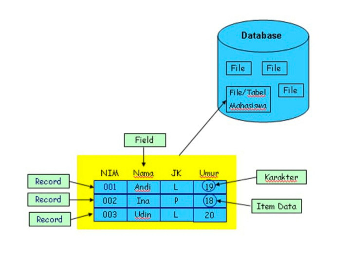
## Struktur tabel dalam basis data
Struktur/Hirarki DataBase adalah struktur organisasi data dalam database yang mengatur hubungan antara entitas atau tabel data.Di dalam hirarki database,data diorganisir dalam bentuk pohon dengan satu entitas induk atau tabel utama yang memiliki beberapa entitas tabel yang terkait.

Database saya anggap seperti Liga Inggris yang dimana Dia Menampung Club" Seperti MU,MC, yg di dalamnya Mempunyai Pemain Yang berbeda beda Sama Seperti Database dimana Dia Menampung File" Yg berbeda beda di dalamnya Contohnya: Ada 4 Club yg saya Ambil 1 saya Uraikan DiMana 4 Club itu ada Manchester United, Manchester city, Tottenham, Aston Villa. Yang saya Uraikan Manchester City dalam bentuk Tabel.
## Struktur Database

| NO |             NO | NAMA                  | KELAS    | UMUR | KLM |
| -- | -------------- | --------------------- | -------- | ---- | --- |
|    | 1              | Ahmad Anugrah Satya   | XI RPL 1 | 16   | L   |
|    | 2              | Muh.Daud Reski Jayadi | XI RPL 1 | 17   | L   |
|    | 3              | Muh.Agis              | XI RPL 1 | 16   | L   |
|    | 4              | Muh.Nur Reski Alfatir | XI RPL 1 | 16   | L   |
### Tabel
Tabel adalah sebuah struktur dasar yang menyimpan data dalam format terstruktur. Setiap tabel memiliki kolom yang mewakili atribut dan baris yang mewakili catatan. Contoh seperti di bawah berikut

- Baris merupakan deretan horizontal yang terdiri dari kata, angka, data atau objek lainnya, contoh di atas contoh untuk baris seperti. 1,Ahmad Anugrah Satya, XI RPL 1, 16, L, 2, Muh.Daud Reski Jayadi, XI RPL 1, 17, L, Dan seterusnya.
- Kolom merupakan deretan vertikal  contoh di atas untuk kolom seperti.  1, 2, 3, 4, Ahmad Anugrah Satya, Muh.Daud Reski Jayadi, Dan seterusnya.
- untuk isinya itu merupakan sebuah item data atau karakter yang di masukkan ke dalam tabel.

### Database
Database (basis data) adalah kumpulan data yang terorganisir dengan cara tertentu untuk memudahkan pengelolaan, penyimpanan, dan pengambilan informasi. Dalam sebuah database, data disimpan dalam tabel yang terdiri dari baris dan kolom. Setiap baris dalam tabel mewakili sebuah catatan atau entitas, sedangkan kolom menyimpan. Di database juga memiliki komponen utama seperti.

1. **Tabel:** Struktur dasar yang menyimpan data dalam format terstruktur. Setiap tabel memiliki kolom yang mewakili atribut dan baris yang mewakili catatan.
    
2. **Baris atau Record:** Masing-masing baris dalam tabel berisi data untuk satu entitas atau catatan tertentu.
    
3. **Kolom atau Field:** Masing-masing kolom dalam tabel menyimpan informasi tentang atribut tertentu, seperti nama, alamat, atau nomor telepon.
	
4. Item Data atau Karakter:  merupakan isian dari baris dan kolom.

# instalasi mySQL
## Menggunakan termux
1. Buka termux
2. Ketik ``termux-setup-storage``
3. Klik izinkan/allow access
4. Lakukan update dan upgrade paket.ketik ``pkg update && upgrade``
5. Jika ada konfirmasi untuk melanjutkan instalasi ketik aja ``Y``
6. Install applikasi mariadb dengan mengetik``pkg install mariadb``
7. Ketika proses nya berhenti dan ada pilihan ketik saja ``Y`` untuk melanjutkan proses penginstalannya. 
8. Ketik ``mysqld_safe`` untuk memberi keamanan
9. Untuk menghentikan proses ``ctrl+z``
10. Masuk ke akun admin ``mysql -u root`` 
## Referensi youtube
https://youtu.be/JojQd-l7fEE?si=OPIB01q45A2FmY1x
# penggunaan awal MySQL
## Query
``<mysql -u root -p>``
## hasil
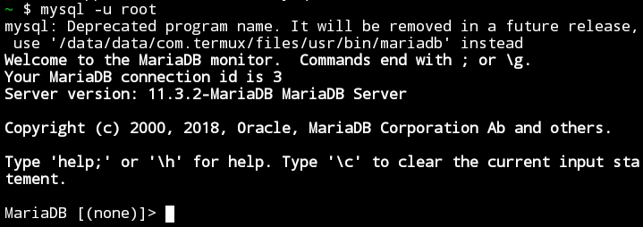

## Analisis kesimpulan
- `<mySQL>` Salah satu aplikasi database server dengan bahasa pemrograman structured query languange `(SQL)` yang berfungsi untuk mengelola data secara terstruktur dan sistematis.
- `<-u root>` Bagian ini mengeset pengguna (user) yang akan digunakan saat terhubung ke server  MYSQL. Dalam contoh ini, pengguna yang digunakan adalah `"root"`. Pengguna `"root"` biasanya memiliki hak akses penuh ke server MYSQL dan dapat melakukan tindakan administratif.
- `<-p>` Opsi ini digunakan untuk meminta kata sandi (password) setelah perintah dijalankan ini adalah langkah keamanan yang umum digunakan untuk memastikan hanya pengguna yang sah yang dapat mengakses server MYSQL. Setelah kita menekan Enter setelah perintah ini, kita akan diminta memasukkan kata sandi untuk pengguna `"root"`.
# Data Base
Database (basis data) adalah kumpulan terstruktur dari informasi yang disimpan secara elektronik dalam sistem komputer. Database dirancang untuk menyimpan, mengatur, dan mengelola data dengan cara yang efisien dan dapat diakses.
## buat data base
- `CREATE DATABASE` adalah perintah untuk membuat database baru.
- ``[XI_RPL_1]`` adalah nama yang Anda pilih untuk database baru Anda. Tanda kurung siku `<("[]")>` digunakan di sini untuk menghindari kesalahan jika nama database mengandung karakter spesial atau spasi. Namun, perlu dicatat bahwa tidak semua DBMS mengizinkan penggunaan tanda kurung siku dalam nama database, jadi pastikan untuk menyesuaikan sintaksdengan DBMS yang Anda gunakan.
### Query
``create database xi_rpl_1;``

### Hasil:
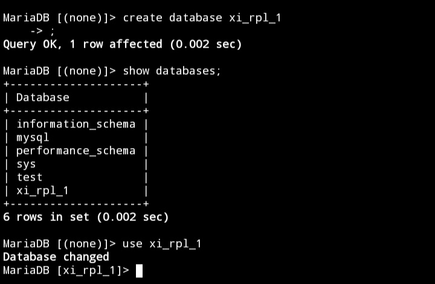
### Analisis Kesimpulan
- CREATE DATABASE adalah perintah untuk membuat database baru.
- XRPL 1 adalah nama yang Anda pilih untuk database baru Anda. Tanda kurung siku '<("{}")>'digunakan di sini untuk menghindari kesalahan jika nama database mengandung karakter spesial atau spasi. Namun, perlu dicatat bahwa tidak semua DBMS mengizinkan penggunaan tanda kurung siku dalam nama database, jadi pastikan untuk menyesuaikan sintaksdengan DBMS yang Anda gunakan.
## Tampilkan data base
`SHOW DATABASE` digunakan untuk menampilkan daftar database yang ada dalam sistem manejemen basis data (DBMS). Perintah ini dapat digunakan di beberapa DBMS seperti MYSQL, PostgreSQL, dan beberapa DBMS lainnya. Namun, perintahnya dapat sedikit berbeda tergantung
### Query 
``show databases;``

### Hasil:
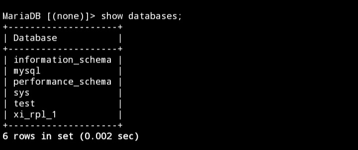
### Analisis Kesimpulan
`SHOW DATABASE` digunakan untuk menampilkan daftar database yang ada dalam sistem manejemen basis data (DBMS). Perintah ini dapat digunakan di beberapa DBMS seperti MYSQL, PostgreSQL, dan beberapa DBMS lainnya. Namun, perintahnya dapat sedikit berbeda tergantung
## hapus database
``<DROP DATABASE [nama_database]>`` digunakan dalam sistem manajemen basis data (DBMS) untuk menghapus sebuah database beserta semua objek yang terkait dengan database tersebut, seperti tabel, indeks, tampilan, prosedur tersimpan, dan lain-lain.
### Query
``drop database xi_rpl_1``
### Hasil:
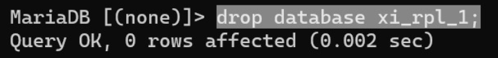
### Analisis Kesimpulan
`DROP DATABASE nama database` digunakan dalam sistem manajemen basis data (DBMS) untuk menghapus sebuah database beserta semua objek yang terkait dengan database tersebut, seperti tabel, indeks, tampilan, prosedur tersimpan, dan lain-lain.
## Gunakan data base
``USE [nama_database]`` digunakan dalam sistem manajemen basis data (DBMS) untuk beralih atau memilih database yang akan digunakan. Ketika Anda menggunakan perintah ``<USE>`` diikuti dengan nama database, DBMS akan mengarahkan semua perintah dan operasi selanjutnya pada database yang ditentukan.
### Query
`` use xi_rpl_1; ``
### Hasil:

### Analisis Kesimpulan
`Use [nams database]` digunakan dalam sistem manajemen basis data (DBMS) untuk beralih atau memilih database yang akan digunakan. Ketika Anda menggunakan perintah uses diikuti dengan nama database, DBMS akan mengarahkan semua perintah dan operasi selanjutnya pada database yang ditentukan.
# Tipe Data
## Angka
**INT**: Untuk menyimpan nilai bilangan bulat (integer). Misalnya, INT dapat digunakan untuk menyimpan angka seperti 1, 100, -10, dan sebagainya.

**DECIMAL**: Digunakan untuk menyimpan nilai desimal presisi tinggi, cocok untuk perhitungan finansial atau keuangan.

**FLOAT dan DOUBLE**: Digunakan untuk menyimpan nilai desimal dengan presisi floating-point. DOUBLE memiliki presisi lebih tinggi dibandingkan FLOAT.

**TINYINT , SMALLINT , MEDIUMINT , dan BIGINT**: Tipe data ini menyimpan bilangan bulat dengan ukuran yang berbeda-beda.
## Teks
**CHAR(N)**: Menyimpan string karakter tetap dengan panjang N. Contoh: CHAR(10) akan menyimpan stringdengan panjang tepat 10 karakter.

**VARCHAR(N)**: Menyimpan string karakter dengan panjang variabel maksimal N. Misalnya,
VARCHAR(255) dapat menyimpan string hingga
255 karakter, tetapi sebenarnya hanya menyimpan panjang yang diperlukan plus
beberapa overhead.

**TEXT**: Digunakan untuk menyimpan teks dengan panjang variabel, tanpa batasan panjang tertentu. Cocok untukdata teks yang panjangnya tidak terduga.

**ENUM**: Memungkinkan Anda mendefinisikan set nilai yang mungkin dan membatasi kolom hanya dapat mengambil salah satu dari nilai tersebut.

**SET**: Mirip dengan ENUM, namun dapat menyimpan satu atau lebih nilai dari himpunan yang telah ditentukan.
## Tanggal
**Date**: digunakan untuk menyimpan informasi tentang tanggal, biasanya terdiri dari hari, bulan, dan tahun seperti 30 Januari 2024

**Time**: digunakan untuk menyimpan informasi tentang waktu dalam sehari, biasanya terdiri dari jam, menit, detik, dan milidetik seperti 14:30:45.500

**DateTime**: menggabungkan informasi tanggal dan waktu dalam satu objek, biasanya terdiri dari hari, bulan, tahun, jam, menit, detik, dan milidetik seperti 30 Januari 2024 14:30:45.500

**TimeStamp**: Sama seperti DATETIME, tetapi dengan kelebihan diatur secara otomatis saat data dimasukkan atau diubah.
## Boolean
**BOOL / BOOLEAN / TINYINT**: Digunakan untuk menyimpan nilai boolean, yang dapat mewakili kebenaran (true) atau kesalahan (flase). 
## Tipe data Pilihan
 **Enum**: Menyimpan satu nilai dari daftar nilai yang ditentukan.
 
 **Set**: Menyimpan beberapa nilai dari daftar nilai yang ditentukan 
# Tabel

## Buat Tabel
**Struktur Query**:
```sql
CREATE TABLE [nama_table] ( 
nama_kolom1 tipe_data(ukuran) [tipe_constraint] 
nama_kolom2 tipe_data(ukuran) [tipe_constraint] 
nama_kolom3 tipe_data(ukuran) [tipe_constraint] );
```

**Contoh Query**:
```sql
CREATE TABLE Pelanggan (
id_pelanggan int(4) PRIMARY KEY NOT NULL,
nama_depan varchar(25) NOT NULL,
nama_belakang varchar(25) NOT NULL,
no_telp char(12) UNIQUE );
```

**Hasil**:
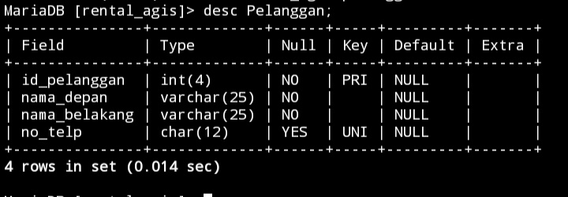

**Analisis**:
- `id_pelanggan`: Kolom bertipe data integer dengan panjang maksimum 4 digit. Dideklarasikan sebagai kunci utama (PRIMARY KEY) yang tidak boleh kosong (NOT NULL).
- `nama_depan`: Kolom bertipe data varchar dengan panjang maksimum 25 karakter. Dideklarasikan sebagai tidak boleh kosong (NOT NULL).
- `nama_belakang`: Kolom bertipe data varchar dengan panjang maksimum 25 karakter. Dideklarasikan sebagai tidak boleh kosong (NOT NULL).
- `no_telp`: Kolom bertipe data char dengan panjang tepat 12 karakter. Dideklarasikan sebagai unik (UNIQUE), yang berarti tidak boleh ada nomor telepon yang sama di antara pelanggan yang berbeda. Tidak dideklarasikan sebagai tidak boleh kosong (NULL).

**Kesimpulan**:
struktur tabel ini memungkinkan untuk menyimpan informasi dasar tentang pelanggan, termasuk identifikasi mereka, nama depan dan belakang, serta nomor telepon yang unik jika tersedia.
## Tampilkan Struktur Tabel
**Struktur Query**:
`desc [nama_table];`

**Contoh Query**:
`desc Pelanggan;`

**Contoh**:


**Analisis**:
`desc pelanggan;`:dapat melihat secara detail karakteristik dari setiap kolom dalam tabel tersebut, termasuk nama kolom, tipe data, panjang maksimum (jika berlaku), dan konstrain khusus seperti PRIMARY KEY, UNIQUE, atau NOT NULL yang diterapkan pada setiap kolom.

**Kesimpulan**:
perintah tersebut memberikan gambaran tentang bagaimana tabel "Pelanggan" telah didefinisikan dalam basis data.
## Menampilkan Daftar Tabel
**Struktur Query**:
`show tables;`

**Contoh**:
`show tables;`

**Hasil**:
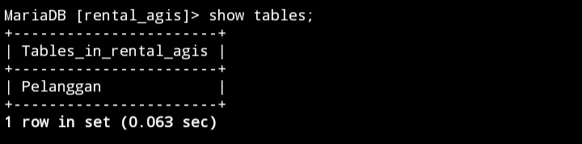

**Analisis**:
`show tables;`:untuk menampilkan semua tabel yang ada dalam database yang sedang aktif.

**Kesimpulan**:
memiliki peran penting dalam memberikan visibilitas awal terhadap struktur database, yang menjadi dasar untuk pekerjaan lebih lanjut dalam pengelolaan dan penggunaan data.
## QNA
>[! Faq]- Mengapa hanya kolom id_pelanggan yang menggunakan constraint PRIMARY KEY?
> > Untuk membedakan id Pelanggan  yang sama, mencegah duplikasi, dan mempermudah pencarian data.


> [! Faq]- Mengapa pada kolom no_telp yang menggunakan tipe data chat bukan varchar?
> > Tipe data char menyimpan data dalam karakter panjang lebih efisien. pencarian pada kolom tipe data `CHAR` dapat lebih cepat.


> [! Faq]- Mengapa hanya kolom no_telp yang menggunakan constraint UNIQUE?
> > Karna no_telp tidak ada yang sama semua pasti berbeda dan nilainya unik maka menggunakan constrains unique artinya data dalam tabel id_telpon berbeda tidak ada yang sama. 


> [! Faq]- Mengapa kolom no_telp tidak memakai constraint NOT NULL, sementara kolom lainnya menggunakan constraint tersebut?
> > Nomor telpon dianggap opsional. nomor telepon hanya menjadi wajib saat pengguna melakukan langkah-langkah tertentu, Anda mungkin tidak ingin mengharuskan pengguna mengisinya pada tahap awal.

> [! Faq]- Perbedaan PK & UNIQUE
> > PRIMERY KEY untuk membedakan data yang sama dan hanya boleh 1 dan tidak boleh tidak ada. Kalau UNiQUE sebuah kolom yang memiliki data yang berbeda atau tidak sama unique boleh 1,2,3 Dan seterusnya dan boleh tidak ada.

# Insert
## Insert 1 Data
### Struktur
```sql
Insert into [nama_tabel]
Values (nilai1, nilai2, nilai3, nilai4)
```
### Contoh
```sql
insert into Pelanggan
values (1,"muhammad","agis","08500000");
```
### Hasil
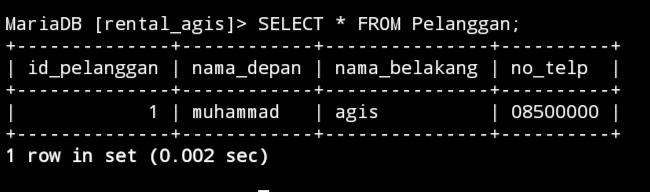
### Analisis

- `insert into Pelanggan`: Ini adalah perintah untuk memasukkan baris data ke dalam tabel "Pelanggan".
- `values (1,"muhammad","agis","08500000")`: Ini adalah nilai yang akan dimasukkan ke dalam tabel "Pelanggan". Urutannya sesuai dengan kolom-kolom pada tabel tersebut.
### Kesimpulan 
mencoba untuk memasukkan data baru ke dalam tabel "Pelanggan".
## Insert > 1 Data
### Struktur
```sql
Insert into [nama_table]
Values (nilai1, nilai2, nilai3, nilai4)
       (nilai1, nilai2, nilai3, nilai4)
       (nilai1, nilai2, nilai3, nilai4)
```
### Contoh
```sql
insert into Pelanggan
values (2,"muh","nur","0890000"),(3,"muh","daud","0870000"),(4,"ahmad","anugrah","08100000");
```
### Hasil
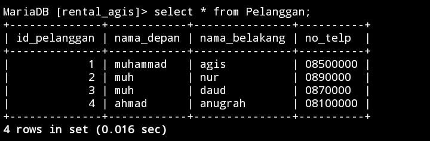

### Analisis 
- `insert into Pelanggan`: Ini adalah perintah untuk memasukkan baris data ke dalam tabel "Pelanggan".
- `values (2,"muh","nur","0890000"),(3,"muh","daud","0870000"),(4,"ahmad","anugrah","08100000");`: Ini adalah nilai yang akan dimasukkan ke dalam tabel "Pelanggan". Urutannya sesuai dengan kolom-kolom pada tabel tersebut.
### Kesimpulan 
data telah dimasukkan ke dalam tabel Pelanggan dengan masing-masing nilai kolom sesuai dengan urutan yang diberikan
## Menyebut Kolom
### Struktur
```sql
insert into [nama_table]
(Kolom1, kolom1, kolom3)
values (niali1, nilai2, nilai3);
```
### Contoh
```sql
insert into Pelanggan
(id_pelanggan,nama_depan,nama_belakang)
values (5,"muh","fadil");
```
### Hasil
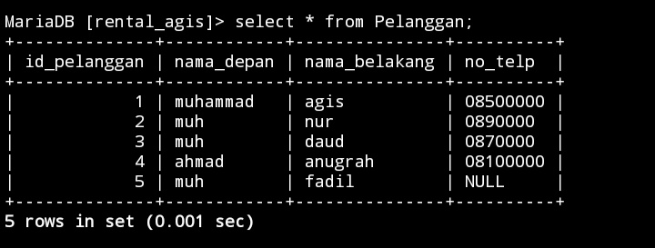
### Analisis
- `insert into Pelanggan`: Ini adalah perintah untuk memasukkan baris data ke dalam tabel "Pelanggan".
- `(id_pelanggan,nama_depan,nama_belakang)`:yang diberikan nilai, sedangkan kolom lainnya akan diisi dengan nilai default jika diperbolehkan atau NULL jika tidak diizinkan.
- `values (5,"muh","fadil")`:Ini adalah nilai yang akan dimasukkan ke dalam tabel "Pelanggan". Urutannya sesuai dengan kolom-kolom pada tabel tersebut.
### Kesimpulan
sebuah entri baru telah dimasukkan ke dalam `tabel Pelanggan`,Tidak ada kolom lain yang diberikan nilai dalam perintah INSERT, sehingga kolom-kolom yang tidak disebutkan akan menggunakan nilai default atau NULL.
# Select
## Seluruh Data
### Struktur
`select * from [nama_table];`
### Contoh
`select * from Pelanggan;`
### Hasil


### Analis 
- `Select` merupakan query yang digunakan untuk menampilkan hasil `insert` 
- `*` artinya semua kolom yang ada di table akan di tampilkan 
- `from` query yang digunakan untuk memberikan penanda bahwa table mana yang akan di tampilkan
- `pelanggan` merupakan nama table yang isi nya akan di tampilkan
### Kesimpulan
program akan mengambil dan menampilkan semua data yang tersimpan dalam tabel Pelanggan, termasuk setiap kolom dan setiap baris yang ada dalam tabel tersebut.
## Data Kolom Tertentu
### Struktur
```sql
Select [nama_kolom1],[nama_kolom2],...[nama_kolomN]
From [nama_table];
```
### Contoh
`select nama_depan from Pelanggan;`
### Hasil
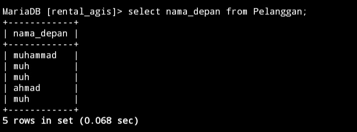

### Analisis
- `Select` merupakan query yang digunakan untuk menampilkan hasil `insert` 
- `nama_depan` nama kolom dalam tabel database yang mungkin menyimpan informasi tentang nama depan dari pelanggan.
- `from` query yang digunakan untuk memberikan penanda bahwa table mana yang akan di tampilkan
- `pelanggan` merupakan nama table yang isi nya akan di tampilkan
### Kesimpulan 
Hasilnya akan berupa daftar `nama_depan` dari semua pelanggan yang terdaftar dalam tabel tersebut.
## Klausa Where
### Struktur
```sql
Select [nama_kolom] from [nama_table] where kondisi;
```
### Contoh
```sql
select id_pelanggan,nama_depan from Pelanggan where id_pelanggan=1;
```
### Hasil
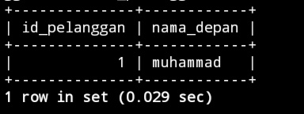

### Analisis
- `Select` merupakan query yang digunakan untuk menampilkan hasil `insert` 
- `id_pelanggan,nama_depan` nama kolom dalam tabel database yang mungkin menyimpan informasi tentang nama depan dari pelanggan.
- `from` query yang digunakan untuk memberikan penanda bahwa table mana yang akan di tampilkan
- `pelanggan` merupakan nama table yang isi nya akan di tampilkan
- `where` untuk menyaring baris data berdasarkan kondisi tertentu.
- `id_pelanggan=1` hanya baris-baris data di mana nilai kolom 
### Kesimpulan 
hasilnya akan berisi ID dan nama depan pelanggan yang memiliki ID tertentu
# Update
## Struktur
```sql
Update nama_table set nama_kolom where kondisi;
```
## Contoh
```sql
Update Pelanggan set no_telp="085326000" where id_pelanggan="1";
```
## Hasil
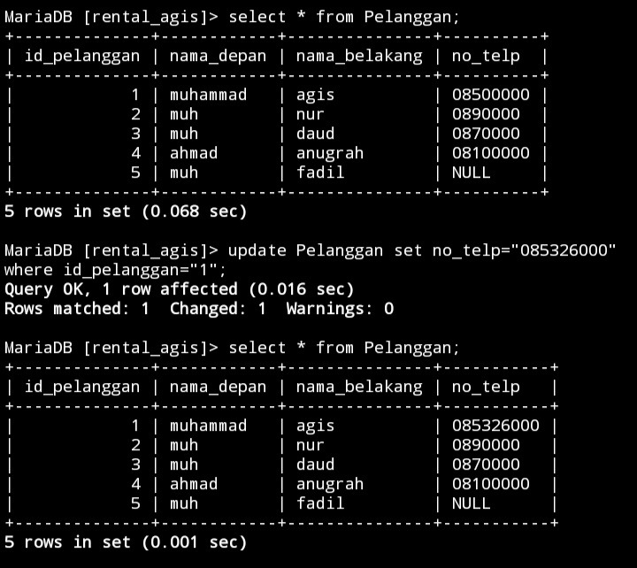

## Analisis 
- `update` adalah query yang digunakan untuk memperbarui nilai dari kolom
- `pelanggan` nama table yang akan di perbarui nilai kolomnya
- `set` query yang digunakan untuk memberikan penanda bahwa yang nilainya akan di rubah 
- `no_telpon` kolom yang akan di ubah nilai nya
- `"0801XXXX"` nilai yang akan dimasukkan 
- `where` query yang digunakan untuk memberikan sebuah kondisi
- `id_pelanggan=1` hanya baris-baris data di mana nilai kolom 
## Kesimpulan 
jika ingin mengubah atau mengupdate sebuah table kalian bisa menggunakan query `update` dengan struktur query yaitu `update nama_table set nama_kolom where kondisi;`
# Delete
## Struktur
```sql
Delete from nama_table where kondisi;
```
## Contoh
```sql
delete from Pelanggan where id_pelanggan="5";
```
## Hasil
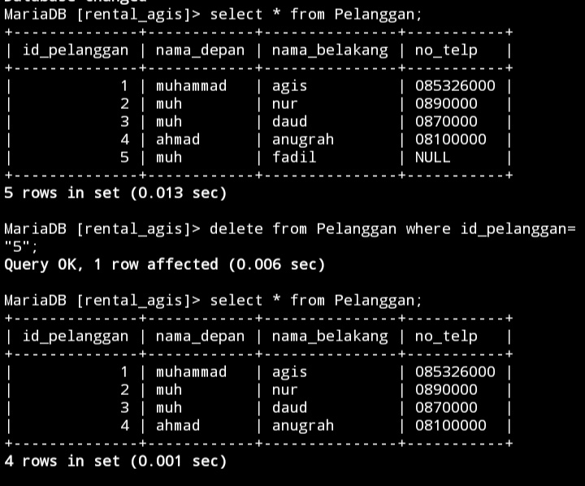
## Analisis
- `delete` query yang digunakan untuk menghapus baris kolom
- `from` query yang digunakan untuk memberikan penanda bahwa table mana yang akan di hapus baris nya
- `pelanggan` nama table yang akan di hapus baris nya
- `where` query yang digunakan untuk memberikan sebuah kondisi
- `id_pelanggan` nama kolom nya 
- `=` operatornya
- `5` nilai nya
## Kesimpulan 
jika ingin menghapus baris table kalian bisa menggunakan query `delete` dengan struktur yaitu `delete from nama_table where kondisi;`