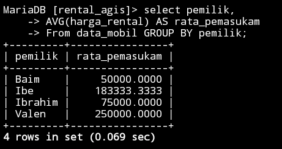

# Operator logika dan Pembanding
## AND 
### Struktur
```sql
select * from nama_table where kolom1="nilai_kolom1" AND kolom2="nama_kolom2";
```
### Contoh
```sql
select * from mobil where warna="Hitam" AND pemilik="Ibrahim";
```
### Hasil

### Analisis
- `SELECT *`: Bagian kueri ini menentukan bahwa Anda ingin mengambil semua kolom dari tabel.
- `FROM mobil`: Ini menunjukkan bahwa Anda menanyakan tabel "mobil".
- `WHERE warna="Hitam" AND pemilik="Ibrahim"`: Ini adalah kondisi untuk memfilter baris. Ini menetapkan bahwa Anda hanya menginginkan baris yang kolom "warna" sama dengan "Hitam" dan kolom "pemilik" sama dengan "Ibrahim".
### Kesimpulan
`"SELECT * FROM mobil WHERE warna='Hitam' AND pemilik='Ibrahim'"` adalah bahwa perintah tersebut akan mengambil semua data dari tabel "mobil" yang memiliki nilai kolom `"warna"` sama dengan `"Hitam"` dan nilai kolom `"pemilik"` sama dengan `"Ibrahim"`, perintah ini akan mengembalikan semua baris dari tabel `"mobil"` yang memenuhi kedua kriteria tersebut. 
## OR
### Struktur 
```sql
select * from nama_table where kolom1="nilai_kolom1" OR kolom2="nilai_kolom2";
```
### Contoh 
```sql
select * from mobil where warna="Hitam" OR pemilik="Ibrahim";
```
### Hasil

### Analisis
- Kolom `"warna"` memiliki nilai `"Hitam"`.
- Kolom `"pemilik"` memiliki nilai `"Ibrahim"`.
Dalam hal ini, perintah `SELECT *`digunakan untuk mengambil semua kolom (semua atribut) dari tabel "mobil". `FROM mobil`menunjukkan bahwa tabel yang dimaksud adalah “mobil”. Kondisi `WHERE`digunakan untuk memfilter baris-baris dalam tabel "mobil". Operator `OR` menunjukkan bahwa setidaknya salah satu kondisi harus dipenuhi agar baris tersebut diambil. Jadi, baris akan diambil jika warna mobil adalah "Hitam" atau jika pemilik mobil adalah "Ibrahim".
### Kesimpulan 
Kesimpulan `"SELECT * FROM mobil WHERE warna='Hitam' OR pemilik='Ibrahim';` adalah bahwa Anda sedang mencari semua data dari tabel "mobil" di mana nilai kolom "warna" sama dengan "Hitam" atau nilai kolom "pemilik" sama dengan "Ibrahim".
## Between
### Struktur
```sql
select * from nama_table where nama_kolom between nilai1 AND nilai2;
```
### Contoh
```sql
select * from mobil where harga_rental between 100000 AND 150000;
```
### Hasil

### Analisis
- `SELECT` : Ini merupakan bagian dari perintah SELECT yang digunakan untuk menentukan kolom mana yang ingin Anda ambil dari tabel. Dalam hal ini, tanda _""_ digunakan untuk mengambil semua kolom yang ada di tabel "mobil".
- `FROM mobil` : Ini menentukan bahwa data akan diambil dari tabel bernama "mobil".
- `WHERE harga_rental BETWEEN 100000 AND 150000` : Ini adalah klausul WHERE yang digunakan untuk memfilter baris yang akan diambil berdasarkan kondisi tertentu. Dalam hal ini, kondisi yang digunakan adalah `"harga_rental BETWEEN 100000 AND 150000"`.
- Operator `BETWEEN` digunakan untuk memeriksa apakah nilai kolom "harga_rental" berada di antara dua angka yang diberikan, yaitu 100.000 dan 150.000.
### Kesimpulan
Kesimpulan `"SELECT * FROM mobil WHERE harga_rental BETWEEN 100000 AND 150000;"` adalah bahwa perintah tersebut digunakan untuk mengambil semua data dari tabel "mobil" yang memenuhi kondisi harga_rental berada di antara 100.000 dan 150.000. 
## Not Between
### Struktur
```sql
select * from nama_table where nama_kolom Not between nilai1 AND nilai2;
```
### Contoh
```sql
select * from mobil where harga_rental not between 100000 AND 150000;
```
### Hasil

### Analisis
- `SELECT `: Bagian ini menentukan bahwa Anda ingin mengambil semua kolom dari tabel yang ditentukan.
- `FROM mobil`: Ini menunjukkan bahwa Anda menanyakan tabel bernama mobil.
- `WHERE harga_rental NOT BETWEEN 100000 AND 150000`: Ini adalah kondisi yang memfilter baris. Ini hanya memilih baris yang nilai kolomnya `harga_rental`tidak berada dalam kisaran 100.000 dan 150.000.
### Kesimpulan
Kesimpulan `"SELECT * FROM mobil WHERE harga_rental NOT BETWEEN 100000 AND 150000;"` adalah bahwa perintah tersebut digunakan untuk mengambil semua data dari tabel "mobil" di mana harga_rental tidak berada di antara 100.000 dan 150.000. 
## <=
### Struktur
```sql
SELECT * FROM nama_table WHERE nama_kolom <= nilai;
```
### Contoh
```sql
SELECT * FROM mobil WHERE harga_rental <= 50000;
```
### Hasil

### Analisis 
- `SELECT *`: Bagian kueri ini digunakan untuk menentukan kolom yang ingin Anda ambil. Tanda bintang `(*)`adalah karakter wildcard yang mewakili semua kolom dalam tabel "mobil".
- `FROM mobil`: Menentukan tabel tempat Anda ingin mengambil data, dalam hal ini, tabel "mobil".
- `WHERE harga_rental <= 50000`: Ini adalah kondisi yang memfilter baris berdasarkan kriteria tertentu. Dalam hal ini, ia hanya memilih baris yang nilai di kolom "harga_rental" kurang dari atau sama dengan 50000.
### Kesimpulan
Kesimpulan `"SELECT * FROM mobil WHERE harga_rental <= 50000;"` adalah bahwa Anda mencari semua data dari tabel "mobil" di mana nilai kolom "harga_rental" kurang dari atau sama dengan 50000.
## >=
### Struktur
```sql
SELECT * FROM nama_table WHERE nama_kolom >= nilai;
```
### Contoh
```sql
SELECT * FROM mobil WHERE harga_rental >= 50000;
```
### Hasil

### Analisis
- `SELECT` digunakan untuk memilih kolom atau data yang ingin ditampilkan dalam hasil query.
- Tanda bintang `('*')`  setelah kata kunci SELECT menunjukkan bahwa semua kolom dalam tabel "mobil" akan ditampilkan dalam hasil query.
- `FROM` digunakan untuk menentukan tabel yang akan digunakan dalam query. Dalam kasus ini, tabel yang digunakan adalah "mobil".
- `WHERE` digunakan untuk melakukan filter atau seleksi pada baris-baris data yang memenuhi kondisi tertentu.
- `Kondisi harga_rental >= 50000` menunjukkan bahwa hanya baris-baris data yang memiliki nilai harga_rental yang lebih besar atau sama dengan 50000 yang akan ditampilkan.
### Kesimpulan
Perintah SQL `SELECT * FROM mobil WHERE harga_rental >= 50000;` digunakan untuk mengambil semua data (semua kolom) dari tabel "mobil" di mana nilai pada kolom "harga_rental" lebih besar atau sama dengan 50000.
## <> atau !=
### Struktur
```sql
select * from nama_table where nama_kolom <> 50000;
```
### Contoh
```sql
select * from mobil where harga_rental <> 50000;
```
### Hasil

### Analisis 
- `SELECT` : Ini menentukan bahwa Anda ingin memilih semua kolom dari tabel.
- `FROM mobil` : Ini menentukan nama tabel "mobil" dari mana Anda ingin mengambil datanya.
- `WHERE harga_rental <> 50000` : Ini adalah kondisi yang memfilter baris. Ini hanya memilih baris dimana nilai di kolom "harga_rental" tidak sama dengan 50000.
### Kesimpulan
Kesimpulan dari  `"SELECT * FROM mobil WHERE harga_rental <> 50000;"` adalah bahwa pernyataan tersebut akan mengembalikan semua baris dari tabel "mobil" di mana nilai kolom "harga_rental" tidak sama dengan 50000.
# Tantangan 
## Tantangan 
### Struktur
```sql
SELECT [nama_kolom] FROM [nama_tabel]
WHERE [nama_kolom] = [nilai];
```
### Contoh
```sql
SELECT nama FROM akun WHERE nama="Agis";
```
### Hasil

### Analisis
- `SELECT nama`: Menunjukkan bahwa kita ingin mengambil data dari kolom nama.
- `FROM akun`: Menunjukkan bahwa tabel sumber data adalah tabel akun.
- `WHERE nama="Agis"`: Menentukan kondisi bahwa hanya baris-baris di mana kolom nama berisi nilai "Agis" yang akan diambil.`
### Kesimpulan 
Kesimpulan dari pernyataan adalah ingin memilih dan menampilkan nilai dari kolom `nama` dalam tabel `akun` yang memiliki nilai `nama` sama dengan `"Agis"`. Jika terdapat entri dalam tabel `akun` dengan `nama "Agis"`, maka nilai tersebut akan ditampilkan.
# IN
## IN
### Struktur
```sql
select * from nama_table where nama_kolom in ("nilai_kolom1","nilai_kolom2");
```
### Contoh
```sql
select * from mobil where warna in ("silver","merah");
```
### Hasil

### Analisis
-  `SELECT * FROM mobil` : Pernyataan ini  memilih semua kolom dari tabel "mobil".
-  `WHERE warna IN ('Silver', 'Merah')` : WHERE digunakan untuk menerapkan kondisi pada hasil query. kondisi yang diterapkan adalah "warna IN ('Silver', 'Merah')", yang berarti hanya baris dengan nilai kolom "warna" yang sama dengan 'Silver' atau 'Merah' yang akan diambil.
### Kesimpulan
Query ini akan mengambil semua baris dari tabel "mobil" di mana nilai kolom "warna" adalah 'Silver' atau 'Merah'. query ini akan mengembalikan semua informasi tentang mobil-mobil yang memiliki warna 'Silver' atau 'Merah'. Hasilnya akan berupa kumpulan baris yang mewakili mobil-mobil dengan warna yang sesuai dengan kriteria tersebut.
## IN+AND
### Struktur
```sql
select * from nama_table
where nama_kolom1 in ("nilai_kolom1","nilai_kolom2")
and nama_kolom2=nilai_kolom;
```
### Contoh
```sql
select * from mobil
where warna in ("Hitam","Silver")
and harga_rental=50000;
```
### Hasil

### Analisis
-  `SELECT * FROM mobil` : memilih semua kolom `(*)` dari tabel "mobil".
-  `WHERE warna in('Hitam','Silver') AND harga_rental = 50000` : Pernyataan WHERE digunakan untuk menerapkan kondisi pada hasil query. terdapat dua kondisi yang diterapkan :
- Kondisi pertama adalah `"warna IN ('Hitam', 'Silver')"`, yang berarti hanya baris dengan nilai kolom "warna" yang sama dengan 'Hitam' atau 'Silver' yang akan diambil.
- Kondisi kedua adalah `"harga_rental = 50000"` , yang berarti hanya baris dengan nilai kolom "harga_rental" yang sama dengan 50000 yang akan diambil.
### Kesimpulan
Kesimpulan dari SQL tersebut adalah mencari semua entri (baris) dalam tabel "mobil" di mana nilai kolom "warna" adalah 'Hitam' atau 'Silver', dan nilai kolom "harga_rental" adalah 50000. query tersebut akan mengembalikan semua data mobil yang memiliki warna 'Hitam' atau 'Silver' dan memiliki harga rental sebesar 50000.
## IN+OR
### Struktur
```sql
select * from nama_table
where nama_kolom1 in ("nilai_kolom1","nilai_kolom2")
or nama_kolom2=nilai_kolom;
```
### Contoh
```sql
select * from mobil
where warna in ("Hitam","Silver")
or harga_rental=50000;
```
### Hasil

### Analisis
SELECT * : Ini memilih semua kolom dari tabel.
FROM mobil : Ini menentukan nama tabel sebagai "mobil" dari mana data akan diambil.
WHERE warna IN ('Hitam', 'Silver') : Kondisi ini memfilter baris berdasarkan nilai pada kolom "warna". Ini memilih baris di mana kolom "warna" memiliki nilai 'Hitam' atau 'Silver'.
OR harga_rental = 50000 : Kondisi ini memfilter lebih lanjut baris-baris tersebut dengan memilih baris-baris yang kolom "harga_rental"-nya bernilai 50000.
### Kesimpulan
Kesimpulan SQL adalah untuk mengambil semua data dari tabel "mobil" dimana warna mobil adalah 'Hitam' atau 'Silver', atau harga rental mobil adalah 50000. menggabungkan kondisi OR antara warna mobil dan harga rental, hasilnya akan mencakup semua mobil yang memiliki warna 'Hitam' atau 'Silver', dan juga mobil dengan harga rental sebesar 50000, termasuk mobil yang memenuhi salah satu atau kedua kondisi tersebut.
## IN+AND+OPERATOR

### >
#### Struktur
```sql
select * from nama_table
where nama_kolom1 in ("nilai_kolom1","nilai_kolom2")
and nama_kolom2 > nilai_kolom;
```
#### Contoh
```sql
select * from mobil
where warna in ("Hitam","Silver")
and harga_rental > 50000;
```
#### Hasil

#### Analisis
1. `SELECT * FROM mobil` : Ini akan mengambil semua kolom dari tabel `mobil`.
2. `WHERE warna in('Hitam','Silver')` : Ini akan memfilter data hanya untuk mobil dengan warna hitam atau perak.
3. `AND harga_rental > 50000` : Ini akan memfilter data hanya untuk mobil dengan harga sewa lebih dari 50.000.
#### Kesimpulan
Query ini akan mengambil data dari tabel `mobil` yang memiliki warna hitam atau perak dan harga sewa lebih dari 50.000. Hasil dari query ini akan menampilkan semua kolom dari tabel `mobil` yang memenuhi kriteria di atas.
### <
#### Struktur
```sql
select * from nama_table
where nama_kolom1 in ("nilai_kolom1","nilai_kolom2")
and nama_kolom2 < nilai_kolom;
```
#### Contoh
```sql
select * from mobil
where warna in ("Hitam","Silver")
and harga_rental < 100000;
```
#### Hasil

#### Analisis
1. `SELECT * FROM mobil` : Ini akan mengambil semua kolom dari tabel `mobil`.
2. `WHERE warna in('Hitam','Silver')` : Ini akan memfilter data hanya untuk mobil dengan warna hitam atau perak.
3. `AND harga_rental < 100000` : Ini akan memfilter data hanya untuk mobil dengan harga sewa kurang dari 100.000.
#### Kesimpulan
Query ini akan mengambil data dari tabel `mobil` yang memiliki warna hitam atau perak dan harga sewa kurang dari 100.000. Hasil dari query ini akan menampilkan semua kolom dari tabel `mobil` yang memenuhi kriteria di atas.
# LIKE
## Mencari Awalan
### Struktur
``` sql
select* from nama_table
Where nama_kolom like "(awal)%"
```
### Contoh
```sql
select * from mobil
where pemilik like "ib%";
```
### Hasil

### Analisis
1. `SELECT * FROM mobil` : Ini akan mengambil semua kolom dari tabel `mobil`.
2. `WHERE pemilik LIKE 'Ib%'` : Ini akan memfilter data hanya untuk mobil yang dimiliki oleh pemilik yang nama awalnya adalah `Ib`. Tanda persen `'%'` digunakan sebagai wildcard untuk mencari nama pemilik yang dimulai dengan 'Ib' dan mengikuti dengan karakter apapun.
### Kesimpulan
Data dari tabel `mobil` yang dimiliki oleh pemilik dengan nama awal `Ib`. Hasil dari query ini akan menampilkan semua kolom dari tabel `mobil
## Mencari Akhiran
### Struktur
```sql
select* from nama_table
Where nama_kolom like "%(akhir)"
```
### Contoh
```sql
select * from mobil
where pemilik like "%m";
```
### Hasil

### Analisis
1. `SELECT * FROM mobil` : Ini akan mengambil semua kolom dari tabel `mobil`.
2. `WHERE pemilik LIKE '%m'` : Ini akan memfilter data hanya untuk mobil yang dimiliki oleh pemilik yang nama terakhirnya adalah 'm' atau berisi huruf 'm'. Tanda persen `'%'` digunakan sebagai wildcard untuk mencari nama pemilik yang mengakhiri dengan 'm' atau berisi huruf 'm' di mana saja.
### Kesimpulan
Query ini akan mengambil data dari tabel `mobil` yang dimiliki oleh pemilik dengan nama terakhir 'm' atau berisi huruf 'm'. Hasil dari query ini akan menampilkan semua kolom dari tabel `mobil` yang memenuhi
## Mencari Awalan & Akhiran 
### Struktur
``` sql
select* from nama_table
Where nama_kolom like "(awal)%(akhir)"
```
### Contoh
```sql
select * from mobil
where pemilik like "b%m";
```
### Hasil

### Analisis
1. `SELECT * FROM mobil` : Ini akan mengambil semua kolom dari tabel `mobil`.
2. `WHERE pemilik LIKE 'b%m'` : Ini akan memfilter data hanya untuk mobil yang dimiliki oleh pemilik yang nama awalnya dimulai dengan huruf 'b' dan nama terakhirnya berakhir dengan huruf 'm'. Tanda persen `'%'` digunakan sebagai wildcard untuk mencari nama pemilik yang dimulai dengan huruf 'b' dan mengikuti dengan karakter apapun, lalu diakhiri dengan huruf 'm'.
### Kesimpulan
tabel `mobil` yang dimiliki oleh pemilik dengan nama awal dimulai dengan huruf 'b' dan nama terakhir berakhir dengan huruf 'm'. Hasil dari query ini akan menampilkan semua kolom dari tabel `mobil
## Mencari berdasarkan total karakter
### Struktur
```sql
select * from nama_table
where nama_kolom like "(awal)__";

select * from nama_table
where nama_kolom like "___";
```
### Contoh
```sql
select * from mobil
where pemilik like "i__";

select * from mobil
where pemilik like "___";
```
### Hasil


### Analisis
-  `SELECT`  :__ Bagian ini memerintahkan database untuk mengambil semua kolom dari `mobil`tabel.
- `FROM mobil:` Ini menentukan tabel dari mana data akan diambil. Dalam hal ini, itu adalah `mobil`meja.
- `WHERE pemilik LIKE 'I__'` : Klausa ini memfilter hasil berdasarkan nilai di `pemilik`kolom. Operator `LIKE`digunakan untuk pencocokan pola.
- `pemilik`: Ini mengacu pada kolom nama yang berisi informasi pemilik.
- `'I__'`: Ini adalah pola yang harus dicocokkan. Tanda kutip tunggal menunjukkan string literal. Di sini, `'I__'` mewakili pemilik yang namanya dimulai dengan huruf `'I'` diikuti dengan dua garis bawah (dua karakter apa saja).

- `SELECT `:__ Instruksi ini meminta untuk memilih semua kolom (atribut) dari tabel `mobil`.
- `FROM mobil:` Ini menentukan tabel tempat data akan diambil, yaitu tabel `mobil`.
- `WHERE pemilik LIKE '___':`Ini adalah klausa `WHERE` yang memfilter data berdasarkan kriteria tertentu.
- `pemilik:` Ini adalah nama kolom yang akan difilter. Biasanya ini mewakili nama pemilik kendaraan.
- `LIKE`: Operator yang digunakan untuk mencari pola tertentu dalam string.
- `'___'`: Adalah pola pencarian yang digunakan.
- `___`  Mencocoki tiga karakter apapun (wildcard).
### Kesimpulan
- `(LIKE 'I__' )`: Mencari pemilik yang diawali dengan huruf `"I"`, diikuti oleh dua karakter apapun. Ini akan mengembalikan pemilik dengan nama minimal 3 karakter.
- `(LIKE '___' )`: Mencari pemilik yang memiliki nama dengan panjang tepat 3 karakter apapun.
## Kombinasi 
### Struktur
```sql
select * from nama_table
where nama_kolom like "(awal)__";

select * from nama_table
where nama_kolom like "___";
```
### Contoh
```sql
select * from mobil
where pemilik like "__(tengah)%";

select * from mobil
where pemilik like "_(tengah)%";
```
### Hasil


### Analisis
- Mencari semua data dari tabel `mobil` (`SELECT *`).
- Di mana nilai pada kolom `pemilik` (`WHERE pemilik LIKE '__r%'`):
- `LIKE`: Operator untuk mencari pola dalam string.
- `'__r%'`: Pola pencarian yang digunakan.
- `__` : Mencocoki dua karakter apapun (wildcard).
- `r` : Mencari huruf `"r"` secara literal.
- `%` : Mencocoki nol karakter atau lebih karakter apapun.

- Mencari semua data dari tabel `mobil` (`SELECT *`).
- Di mana nilai pada kolom `pemilik` (`WHERE pemilik LIKE '_b%'`):
- `LIKE`: Operator untuk mencari pola dalam string.
- `'_b%'`: Pola pencarian yang digunakan.
- `_` : Mencocoki satu karakter apapun.
- `b` : Mencari huruf `"b"` secara literal.
- `%` : Mencocoki nol karakter atau lebih karakter apapun.
### Kesimpulan
- `(LIKE '__r%' )`: Mencari pemilik yang namanya berakhiran dengan huruf `"r"`. Ini akan mengembalikan pemilik dengan nama minimal 3 karakter.
- `(LIKE '_b%' )`: Mencari pemilik yang namanya memiliki huruf `"b"` di posisi kedua. Ini akan mengembalikan pemilik dengan nama minimal 3 karakter.
## Not Like
### Struktur
```sql
select * from nama_table where nama_kolom not like "(awal)%";
```
### Contoh
```sql
select * from mobil where peminjam not like "a%";
```
### Hasil

### Analisis
1. `SELECT * FROM mobil` : Ini akan mengambil semua kolom dari tabel `mobil`.
2. `WHERE peminjam NOT LIKE 'A%'` : Ini akan memfilter data hanya untuk mobil yang saat ini tidak dipinjam oleh `peminjam` yang nama awalnya dimulai dengan huruf `'A'`. Tanda persen `'%'` digunakan sebagai wildcard untuk mencari nama peminjam yang dimulai dengan huruf 'A' dan mengikuti dengan karakter apapun. Tanda negasi `NOT` digunakan untuk mengecualikan peminjam dengan nama awal yang dimulai dengan huruf `'A'`.
### Kesimpulan
Kesimpulan `"SELECT * FROM mobil WHERE peminjam NOT LIKE 'A%'"` adalah bahwa query tersebut akan mengembalikan semua data dari tabel `mobil` dimana nilai kolom `peminjam` tidak dimulai dengan huruf ``A'`.
# Null & Not Null
## Mencari data kosong 
### Struktur 
```sql
select * from nama_table where nama_kolom is NULL;
```
### Contoh
```sql
select * from mobil where peminjam is NULL;
```
### Hasil

### Analisis
- `SELECT` : Menginstruksikan untuk memilih semua kolom (atribut) dari tabel `mobil`.
- `FROM mobil:` Mendefinisikan tabel tempat data akan diambil, yaitu tabel `mobil`.
- `WHERE peminjam IS NULL:` Ini adalah klausa `WHERE` yang memfilter data berdasarkan kondisi tertentu.
- `peminjam:` Merujuk pada kolom pada tabel `mobil` yang kemungkinan berisi nama `peminjam` kendaraan.
- `IS NULL:` Operator perbandingan yang mengecek apakah nilai pada kolom `peminjam` adalah `NULL`.
### Kesimpulan
- Perintah ini hanya mengembalikan mobil dengan kolom `peminjam` bernilai `NULL` (tidak ada data peminjam).
- Perintah ini membantu dalam mengidentifikasi mobil yang tersedia untuk dipinjam.
- Hasilnya bergantung pada data yang ada di kolom `peminjam` pada tabel `mobil`.
## Mencari data yang tidak kosong
### Struktur 
```sql
select * from nama_table where nama_kolom is NOT NULL;
```
### Contoh
```sql
select * from mobil where peminjam is NOT NULL;
```
### Hasil

### Analisis
- `SELECT *`: Ini adalah klausa `SELECT` yang digunakan untuk memilih semua kolom dari tabel `mobil`. Dengan menggunakan tanda bintang `(*)`, kita memilih semua kolom yang ada dalam tabel.
- `FROM mobil`: Ini adalah klausa `FROM` yang menentukan tabel yang akan digunakan dalam kueri. Dalam hal ini, tabel yang digunakan adalah `mobil`.
- `WHERE peminjam IS NOT NULL`: Ini adalah klausa `WHERE` yang digunakan untuk menerapkan kondisi pada kueri. Kondisi yang diterapkan di sini adalah `peminjam IS NOT NULL`, yang berarti hanya baris-baris di mana kolom `peminjam` tidak kosong atau memiliki nilai yang tidak `NULL` akan dipilih.
### Kesimpulan
Digunakan untuk mengambil semua baris dari tabel  `"mobil"`  di mana kolom  `"peminjam"`  memiliki nilai yang tidak `NULL`. Hasilnya akan berisi semua kolom dari baris-baris ini.
# Order By & Limit
## Mengurutkan data dari data terkecil
### Struktur
```sql
select * from nama_table ORDER BY nama_kolom ASC;
```
### Contoh
```sql
select * from mobil ORDER BY pemilik ASC;
```
### Hasil

### Analisis
- `SELECT *`: Ini adalah klausa `SELECT` yang digunakan untuk memilih semua kolom dari tabel `mobil`. Dengan menggunakan tanda bintang `(*)`, kita memilih semua kolom yang ada dalam tabel.
- `FROM mobil`: Ini adalah klausa `FROM` yang menentukan tabel yang akan digunakan dalam kueri. Dalam hal ini, tabel yang digunakan adalah `mobil`.
- `ORDER BY pemilik ASC`: Ini adalah klausa `ORDER BY` yang digunakan untuk mengurutkan hasil berdasarkan kolom `pemilik` secara menaik (ascending). Dengan menggunakan `ASC`, hasil akan diurutkan dari nilai terkecil hingga terbesar berdasarkan kolom `pemilik`.
### Kesimpulan
- `SELECT * FROM mobil` mengambil semua data dari tabel `mobil`.
- `ORDER BY pemilik ASC` mengurutkan data berdasarkan kolom `pemilik` secara ascending (terkecil ke besar).
## Mengurutkan data dari data terbesar
### Struktur
```sql
select * from nama_table ORDER BY nama_kolom desc;
```
### Contoh
```sql
select * from mobil ORDER BY peminjam  desc;
```
### Hasil

### Analisis
- `SELECT`: Perintah ini digunakan untuk mengambil semua kolom atau field dari tabel mobil.
- `FROM mobil`: Ini menunjukkan bahwa tabel yang akan digunakan adalah `mobil`.
- `ORDER BY peminjam DESC`: Ini adalah bagian penting dari perintah yang akuntansi database untuk mengurutkan hasil berdasarkan kolom `peminjam` secara menurun (urutan menurun). Artinya, hasilnya akan diurutkan dari nilai yang paling tinggi ke nilai yang paling rendah pada kolom `peminjam`.
### Kesimpulan
- Pernyataan ini digunakan untuk mengambil seluruh data dari tabel `mobil`.
- Data akan diurutkan berdasarkan kolom `peminjam` secara menurun (descending order). Artinya, data akan disusun dari nilai `peminjam` terbesar ke terkecil.
- Kesimpulannya, hasil query akan mengembalikan semua baris dari tabel `mobil` dengan urutan berdasarkan kolom `peminjam` dari nilai terbesar ke terkecil.
## Membatasi data yang tampil
### Struktur
```sql
SELECT * FROM [nama_tabel]    WHERE [nama_kolom] = [nilai] ORDER BY         [nama_kolom] ASC LIMIT [nilai];
```
### Contoh

```sql
SELECT * FROM mobil 
WHERE warna = 'Hitam' ORDER BY
harga_rental ASC LIMIT 2;
```
### Hasil

### Analisis
- `SELECT * FROM : `Merupakan query awal untuk menampilkan sebuah tabel yang didalamnya berisikan kolom, di mana kolom tersebut menampung sebuah data.
- `mobil` nama dari tabel yang ingin kita tampilkan data-data nya.
- `WHERE warna = 'Hitam' `Memilih hanya baris-baris di mana nilai kolom warna adalah `'Hitam'.`
- `ORDER BY harga_rental ASC` Mengurutkan baris-baris tersebut berdasarkan kolom harga_rental secara menaik (dari harga rental terendah ke tertinggi).
- `LIMIT 2 `Membatasi hasil query untuk hanya menampilkan 2 baris pertama yang memenuhi kondisi warna hitam dan diurutkan berdasarkan harga rental.
### Kesimpulan
Perintah SQL tersebut mengambil data `mobil` berwarna `hitam` dengan `harga_rental` terendah, hanya menampilkan 2 hasil teratas.
# DISTINCT
## DISTINCT
### Struktur 
```sql
select DISTINCT(nama_kolom) from nama_table;
```
### Contoh
```sql
select DISTINCT(pemilik) from mobil;
```
### Hasil

### Analisis
- `SELECT DISTINCT (harga_rental)` : Ini adalah klausul SELECT yang digunakan untuk memilih kolom "harga_rental". Kata kunci "DISTINCT" digunakan untuk mengambil nilai unik dari kolom tersebut.
- `FROM mobil` : Ini adalah klausul FROM yang menentukan tabel yang digunakan dalam query, yaitu "mobil".
### Kesimpulan
Kesimpulannya, hasil query akan mengembalikan nilai unik dari kolom "harga_rental" dari tabel "mobil", diurutkan dari nilai terbesar ke terkecil. Ini akan memberikan daftar harga rental yang berbeda yang tersedia untuk mobil, tanpa duplikasi, dalam urutan terurut.
## DISTINCT+ORDER BY
### Struktur 
```sql
select DISTINCT(nama_kolom) from nama_table ORDER BY nama_kolom desc;
```
### Contoh
```sql
select DISTINCT(harga_rental) from mobil ORDER BY harga_rental desc;
```
### Hasil

### Analisis
- `SELECT DISTINCT(harga_rental)`: Bagian ini meminta data yang unik dari kolom `harga_rental `dalam tabel `mobil`. Artinya, jika ada nilai yang duplikat, hanya satu nilai yang akan diambil untuk setiap set nilai yang sama. Ini digunakan untuk memastikan bahwa hasil query ini hanya menampilkan nilai-nilai unik.
- `FROM mobil`: Bagian ini menentukan tabel dari mana data diambil. Dalam hal ini, data diambil dari tabel bernama `mobil`.
- `ORDER BY harga_rental DESC`: Bagian ini mengatur urutan hasil query berdasarkan kolom harga_rental dalam urutan menurun (dari yang terbesar ke yang terkecil). Dengan kata lain, hasilnya akan diurutkan sehingga nilai terbesar akan berada di bagian atas.
1. Mengidentifikasi Harga Rental Tertinggi:
- Dengan mengurutkan dalam urutan menurun, kita dapat dengan cepat mengidentifikasi harga rental tertinggi di dalam dataset.
2. Mengidentifikasi Rentang Harga Rental:
- Dengan melihat daftar harga yang unik, kita bisa mengetahui variasi harga rental dan rentang dari tertinggi ke terendah.
3. Analisis Harga Rental Unik:
- Karena menggunakan DISTINCT, query ini bisa membantu menemukan harga rental yang unik tanpa pengulangan, memberikan gambaran tentang berapa banyak variasi harga yang tersedia dalam tabel mobil.
### Kesimpulan
query ini berguna untuk analisis harga rental yang unik dan untuk memahami rentang harga dalam tabel `mobil`, yang dapat digunakan untuk berbagai tujuan, seperti perbandingan harga, analisis pasar, atau pengambilan keputusan bisnis.
# CONCAT,CONCAT_WA,AS
## Menggabungkan kolom tanpa pemisah
### Struktur 
```sql
SELECT CONCAT(nama_kolom1,nama_kolom2) FROM mobil;
```
### Contoh
```sql
SELECT CONCAT(pemilik,warna) FROM mobil;
```
### Hasil

### Analisis
- `SELECT` digunakan untuk memilih kolom yang ingin ditampilkan.
- `CONCAT()` menggabungkan dua nilai string menjadi satu.
- `pemilik` dan `warna` adalah kolom dari tabel `mobil`.
### Kesimpulan
perintah tersebut akan menggabungkan nilai dari kolom`pemilik` dan `warna` dalam tabel `mobil` menjadi satu string untuk setiap baris dalam tabel tersebut. Hasilnya akan berupa satu kolom baru yang bernama `CONCAT` yang berisi hasil penggabungan tersebut.
## Menggabungkan kolom dengan pemisah
### Struktur 
```SQL
SELECT CONCAT_WS("pemisah",nama_kolom1,nama_kolom2,nama_kolom3) FROM mobil;
```
### Contoh
```sql
SELECT CONCAT_WS("-",no_plat,no_mesin,id_mobil) FROM mobil;

```
### Hasil

### Analisis
- **`SELECT`** digunakan untuk memilih kolom yang ingin ditampilkan.
- **`CONCAT_WS`** berfungsi untuk menggabungkan beberapa nilai string menjadi satu string, dipisahkan dengan separator yang ditentukan.
- **`WS`** artinya "With Space" (dengan spasi).
- **`"-"`** adalah pembatas yang digunakan dalam kueri ini (bisa diganti dengan karakter lain).
- `no_plat`, `no_mesin`, dan `id_mobil`  adalah kolom dari tabel `mobil`.
### Kesimpulan
kesimpulan dari `SELECT CONCAT_WS("-", no_plat, no_mesin, id_mobil) FROM mobil;` adalah bahwa Anda sedang menggabungkan kolom `no_plat, no_mesin, dan id_mobil` dalam tabel mobil menjadi satu string dengan menggunakan tanda hubung `(-)` sebagai pemisah.
## Memberi nama kolom alias
### Struktur
```sql
SELECT CONCAT_WS("pemisah",nama_kolom1, nama_kolom2) AS nama_alias FROM mobil;
```
### Contoh
```sql
SELECT CONCAT_WS("+",pemilik,peminjam) AS COLLAB FROM mobil;
```
### Hasil

### Analisis
- **`SELECT`** digunakan untuk memilih kolom yang ingin ditampilkan.
- **`CONCAT_WS`** berfungsi untuk menggabungkan dua nilai string menjadi satu string, dipisahkan dengan separator yang ditentukan.
    - **`WS`** artinya "With Space" (dengan spasi).
    - **`+`** adalah pembatas yang digunakan dalam kueri ini (bisa diganti dengan karakter lain).
- `pemilik` dan `peminjam` adalah kolom dari tabel `mobil`.
- **`AS COLLAB`** memberi alias pada kolom baru sebagai `COLLAB`.
### Kesimpulan
Kesimpulan dari pernyataan SQL `SELECT CONCAT_WS("+", pemilik, peminjam) AS COLLAB FROM mobil;` adalah bahwa Anda sedang menggabungkan kolom pemilik dan peminjam dalam tabel mobil menjadi satu string dengan menggunakan tanda tambah `(+)` sebagai pemisah.
# VIEW
## Membuat tabel virtual
### Struktur 
```sql
CREATE VIEW nama_table AS
Select nama_kolom1,nama_kolom2,nama_kolom3,nama_kolom4
From nama_table
Where nama_kolom = "nilai_kolom";
```
### Contoh
```sql
CREATE VIEW info_no_plat AS
SELECT id_mobil, no_plat, pemilik, peminjam
FROM mobil
WHERE pemilik = "Ibrahim";
```
### Hasil

### Analisis
- **`CREATE VIEW`** digunakan untuk membuat view baru.
- **`info_no_plat`** adalah nama view yang dibuat.
- **`SELECT`** digunakan untuk memilih kolom yang ingin ditampilkan dalam view.
- `id_mobil`, `no_plat`, `pemilik`, dan `peminjam` adalah kolom yang ditampilkan dalam view.
- **`FROM`** menunjukkan tabel sumber data, yaitu `mobil`.
- **`WHERE`** digunakan untuk menyaring data berdasarkan kondisi, yaitu `pemilik = "Ibrahim"`.
### Kesimpulan
Kesimpulan dari `CREATE VIEW info_no_plat AS SELECT id_mobil, no_plat, pemilik, peminjam FROM mobil WHERE pemilik = "Ibrahim";` adalah bahwa Anda sedang membuat sebuah view dengan nama "info_no_plat". View ini akan menampilkan kolom-kolom id_mobil, no_plat, pemilik, dan peminjam dari tabel mobil hanya untuk baris-baris di mana nilai kolom pemilik adalah "Ibrahim".
## Menampilkan tabel virtual
### Struktur 
```sql
Select * FROM nama_table;
```
### Contoh
```sql
SELECT * FROM info_no_plat;
```
### Hasil

### Analisis
- `SELECT *` digunakan untuk memilih semua kolom yang ada di view `info_no_plat`.
- `FROM info_no_plat` menunjukkan bahwa data akan diambil dari view `info_no_plat`.
### Kesimpulan
perintah `SELECT *`, Anda memilih semua kolom yang ada dalam view `info_no_plat`. Hasilnya akan mengembalikan semua baris yang memenuhi kondisi `pemilik = "Ibrahim"` dari tabel `mobil`, termasuk semua kolom yang ada dalam view tersebut.
## Menghapus tabel virtual
### Struktur 
```sql
DROP VIEW nama_table;
```
### Contoh
```sql
DROP VIEW info_no_plat;
```
### Hasil

### Analisis
- `DROP VIEW`: Ini adalah perintah yang digunakan untuk menghapus view dari database. Dalam hal ini, perintah ini digunakan untuk menghapus view "info_no_plat".
- `info_no_plat`: Ini adalah nama view yang akan dihapus. Nama ini harus sesuai dengan nama view yang ingin Anda hapus.
### Kesimpulan
Perintah `DROP VIEW` digunakan untuk menghapus view yang telah dibuat sebelumnya. Dalam hal ini, perintah tersebut akan menghapus view `info_no_plat` dari database. Setelah perintah dijalankan, view tersebut tidak akan lagi tersedia dan tidak dapat digunakan untuk mengambil data.
# Tantangan 
## Mobil Tanpa Peminjam
### Kode
```sql
CREATE VIEW mobil_Tanpa_peminjam AS
Select no_plat,peminjam
From mobil
WHERE peminjam IS NULL ;
```
### Hasil

### Analisis
CREATE VIEW mobil_Tanpa_peminjam AS`: adalah perintah untuk membuat sebuah `view` baru dalam basis data dengan nama `mobil_Tanpa_peminjam`.
- `SELECT no_plat, peminjam`: adalah perintah untuk memilih dua kolom, yaitu `no_plat dan peminjam`, dari tabel `mobil`.
- `FROM mobil`: Menunjukkan bahwa data diambil dari tabel bernama `mobil`.
- `WHERE peminjam IS NULL`:  adalah klausa WHERE yang menyaring baris-baris dari tabel mobil dimana nilai `kolom peminjam` adalah `NULL`.

- `SELECT *`: adalah perintah untuk memilih semua kolom dari `view atau tabel`.
- `FROM mobil_Tanpa_peminjam`: Menunjukkan bahwa data diambil dari view yang disebut `mobil_Tanpa_peminjam`, yang telah dibuat sebelumnya.
### Kesimpulan 
`CREATE VIEW mobil_Tanpa_peminjam AS Select no_plat, peminjam From mobil WHERE peminjam IS NULL;` digunakan untuk membuat sebuah `view` baru bernama `mobil_Tanpa_peminjam`. `Viewnya` berisi dua kolom, yaitu `no_plat` dan `peminjam`, yang diambil dari tabel `mobil` Hanya baris-baris yang memiliki nilai `NULL` pada kolom `peminjam` yang dimasukkan ke dalam `view`. 

`SELECT * FROM mobil_Tanpa_peminjam;` digunakan untuk menampilkan semua data dari `view mobil_Tanpa_peminjam`, yang telah dibuat sebelumnya dengan kriteria yang bernilai `NULL`.
## Update Mobil
### Kode
```sql
UPDATE mobil
SET peminjam = NULL
where peminjam =  'Elia' ;
```
### Hasil

### Analisis
- `UPDATE mobil`: adalah perintah untuk memperbarui data dalam tabel yang disebut `mobil`.
- `SET peminjam= NULL`: menetapkan nilai kolom peminjam menjadi `NULL`.
- `WHERE peminjam= 'Elia'`: adalah klausa WHERE yang membatasi update hanya pada baris-baris dimana nilai kolom peminjam adalah `'Elia'`. Maksudnya perubahan hanya akan berlaku untuk baris-baris yang memiliki peminjam dengan nama `'Elia'`.

- `SELECT *`: adalah perintah untuk memilih semua kolom dari view atau tabel.
- `FROM mobil_Tanpa_peminjam`: Menunjukkan bahwa data diambil dari view yang disebut "mobil_Tanpa_peminjam", yang telah dibuat sebelumnya.
### Kesimpulan
`UPDATE mobil SET peminjam = NULL WHERE peminjam = 'Elia';`nilai pada kolom `peminjam` pada tabel `mobil`yang memiliki nilai `'Elia'` akan diubah menjadi `NULL`.
Kesimpulannya, perintah digunakan untuk menghapus atau mengubah nilai `peminjam` menjadi `NULL` untuk semua entri di tabel `mobil` dimana `peminjam`memiliki nilai `'Elia'`.

`SELECT * FROM mobil_Tanpa_peminjam;` digunakan untuk menampilkan semua data dari `view mobil_Tanpa_peminjam`, yang telah dibuat sebelumnya dengan mengubah atau menghapus nilai `peminjam` menjadi `NULL` untuk tabel `mobil` dimana peminjam memiliki nilai `Elia`.
## Kesimpulan 
Berikan Kesimpulan mengapa tabel Virtual 1,2 ini dibuat?
View dapat digunakan untuk menyaring data yang sesuai dengan kriteria tertentu, seperti menampilkan entri yang memiliki nilai NULL pada kolom tertentu atau mengubah salah satu data peminjam menjadi NULL. memberikan pandangan yang jelas tentang mobil yang tersedia untuk disewakan atau yang belum dipinjam.
Dengan membuat view dapat membatasi akses ke data sensitif atau kolom tertentu dari tabel yang mungkin tidak perlu diakses oleh semua pengguna.
Dengan membuat view untuk kueri yang sering digunakan, Anda dapat menghindari pengulangan kode SQL yang sama di beberapa tempat dalam aplikasi atau prosedur penyimpanan.
# AGREGASI
## SUM
Perintah SUM digunakan untuk menghitung total dari nilai-nilai numerik dalam suatu kolom. Ini sering digunakan bersama dengan pernyataan SELECT untuk mengambil hasil agregasi dari data dalam tabel.
### Struktur 
```sql
select SUM(nama_kolom) AS total
From nama_table
Where kondisi_opsional;
```
### Contoh
```sql
select SUM(harga_rental) from mobil;
```
### Hasil

### Analisis
- `SELECT`: Digunakan untuk mengambil data dari database.
- `SUM()`: Fungsi agregat dalam SQL yang digunakan untuk menghitung jumlah nilai dalam kolom.
- `harga_rental`: Ini adalah nama kolom yang ingin Anda hitung jumlahnya.
- `FROM mobil`: Menentukan tabel dari mana Anda ingin mengambil datanya, dalam hal ini, tabel bernama `mobil`.
### Kesimpulan
Kesimpulan dari pernyataan SQL `SELECT SUM(harga_rental) FROM mobil;` adalah bahwa Anda ingin menghitung jumlah total `harga_rental` dari semua mobil yang ada dalam tabel `mobil`.
## Count
Perintah COUNT digunakan untuk menghitung jumlah baris yang memenuhi suatu kondisi atau untuk menghitung jumlah baris dalam suatu tabel.
### Struktur 
```sql
select Count(*) AS jumlah
From nama_table
Where kondisi_opsional;
```
### Contoh
**Contoh 1**
```sql
select Count(pemilik) from mobil;
```
**Contoh 2**
```sql
select Count(Peminjam) from mobil;
```
### Hasil
**Hasil 1**

**Hasil 2**

### Analisis
**pemilik**
- `SELECT` : Kata kunci ini digunakan untuk mengambil data dari database.
- `COUNT()` : Ini adalah fungsi agregat yang menghitung jumlah baris yang dikembalikan oleh kueri. Dalam hal ini, ia akan menghitung jumlah nilai bukan nol pada kolom `pemilik`.
- `pemilik` : Ini nama kolomnya. Fungsi ini `COUNT()`akan menghitung jumlah nilai bukan nol di kolom ini.
- `FROM mobil` : Ini menentukan tabel dari mana data akan diambil. Dalam hal ini, itu adalah tabel `mobil`.
**peminjam**
- `SELECT`: Kata kunci ini digunakan untuk mengambil data dari database.
- `COUNT(peminjam)`: Fungsi ini menghitung jumlah nilai bukan nol pada kolom yang ditentukan, dalam hal ini, `peminjam`.
- `FROM mobil`: Ini menentukan tabel untuk mengambil data, dalam hal ini, tabel bernama `mobil`.
### Kesimpulan
**pemilik**
Kesimpulan dari `SELECT COUNT(pemilik) FROM mobil;` adalah bahwa Anda ingin menghitung jumlah entri unik dalam kolom `pemilik` dari tabel `mobil`.

**peminjam**
Kesimpulan dari `SELECT COUNT(peminjam) FROM mobil;` adalah bahwa Anda ingin menghitung jumlah entri unik dalam kolom `peminjam` dari tabel `mobil`. Hasilnya akan memberikan jumlah peminjam mobil yang terdaftar dalam tabel. 
## Min 
Fungsi MIN digunakan menemukan nilai minimum dalam suatu kolom. Fungsi ini berguna ketika kita ingin mengetahui nilai terkecil dalam satu set data.
### Struktur 
```sql
select Min(nama_kolom) AS nilai_minimum
From nama_table
Where kondisi_opsional;
```
### Contoh
```sql
select Min(harga_rental) AS minimal from mobil;
```
### Hasil

### Analisis
- `SELECT`: Menunjukkan bahwa ingin mengambil data dari database.
- `MIN(harga_rental)`: Menghitung nilai minimum kolom `harga_rental`.
- `AS MINIMAL`: Menetapkan alias `MINIMAL` pada hasil fungsi `MIN(harga_rental)`.
- `FROM mobil`: Menentukan tabel `mobil`untuk mengambil data.
### Kesimpulan
Kesimpulan dari `SELECT MIN(harga_rental) AS MINIMAL FROM mobil;` adalah bahwa Anda ingin mencari nilai terkecil (minimum) dari kolom "harga_rental" dalam tabel "mobil".
## Max
Fungsi MAX digunakan untuk menemukan nilai maksimum dari suatu kolom. Fungsi ini berguna ketika kita ingin mengetahui nilai terbesar dalam satu set data.
### Struktur 
```sql
select Max(nama_kolom) AS nilai_maksimal
From nama_table
Where kondisi_opsional;
```
### Contoh
```sql
select Max(harga_rental) AS maximal from mobil;
```
### Hasil

### Analisis
- `SELECT`: Digunakan untuk mengambil data dari database.
- `MAX(harga_rental)`: Fungsi ini menghitung nilai maksimum kolom 'harga_rental' dan mengambil nilai tertinggi yang ada di kolom itu.
- `AS MAXIMAL`: Mengubah nama hasil perhitungan `MAX(harga_rental)`menjadi 'MAXIMAL'. Itu adalah alias untuk hasilnya.
### Kesimpulan
Kesimpulan dari pernyataan SQL ini adalah bahwa Anda ingin mencari nilai terbesar (maksimum) dari kolom `"harga_rental" dalam tabel "mobil"` . Hasilnya akan disajikan dengan menggunakan alias "MAXIMAL" dalam kolom hasil.
## AVG
Fungsi agregasi yang digunakan untuk menghitung nilai rata-rata 
### Struktur 
```sql
select AVG(nama_kolom) AS nilai_rata-rata
From nama_table
Where kondisi_opsional;
```
### Contoh
```sql
select AVG(harga_rental) AS RATA_RATA from mobil;
```
### Hasil

### Analisis
- `SELECT AVG(harga_rental)`: Ini adalah perintah SQL yang digunakan untuk mengambil nilai rata-rata dari kolom `harga_rental`. `AVG()` adalah fungsi agregat yang digunakan untuk menghitung rata-rata dari sekumpulan nilai.
- `AS RATA_RATA`: Menggunakan kata kunci `AS` untuk memberi nama pada hasil rata-rata. Dalam hal ini, hasil rata-rata dari `harga_rental` akan dinamai `RATA_RATA`.
- `FROM mobil`: Ini adalah bagian dari perintah SQL yang menunjukkan bahwa data diambil dari tabel bernama `mobil`. Jadi, perintah ini mengambil nilai rata-rata dari kolom `harga_rental` dari tabel `mobil`.
### Kesimpulan
Kesimpulan dari pernyataan SQL `SELECT AVG(harga_rental) AS RATA_RATA FROM mobil;` adalah bahwa Anda ingin menghitung nilai rata-rata (average) dari kolom "harga_rental" dalam tabel "mobil".
# Tantangan 
## 1. Tampilkan jumlah data mobil dan kelompok kan berdasarkan warnanya sesuai dengan tabel mobil kalian
### Struktur 
```sql
select nama_data,
COUNT(nama_data) AS nama_sementara 
FROM nama_tabel GROUP BY nama_data;
```
### Query
```sql
select warna,
COUNT(id_mobil) AS Jumlah_Data_Mobil
FROM data_mobil GROUP BY warna;
```
### Hasil

### Analisis
- `SELECT Klausa` : warna: Memilih kolom warna dari tabel `data_mobil`.
- `COUNT(id_mobil) AS Jumlah_Data_Mobil`: Menghitung jumlah baris (mobil) untuk setiap warna unik dan memberi alias `Jumlah_Data_Mobil` pada hasil hitungan tersebut.
- `FROM Klausa`: `data_mobil`: Menentukan tabel `data_mobil` sebagai sumber data.
- `GROUP BY Klausa`: `warna`: Mengelompokkan hasil query berdasarkan nilai di kolom warna. Setiap nilai unik dalam kolom warna akan menjadi satu grup.
### Kesimpulan
1. Mengelompokkan Data Berdasarkan Warna: Data dalam tabel data_mobil dikelompokkan berdasarkan kolom warna.
2. Menghitung Jumlah Mobil untuk Setiap Warna: Menggunakan fungsi COUNT(id_mobil) untuk menghitung jumlah mobil dalam setiap grup warna.
3. Memberikan Hasil yang Jelas: Hasil dari query ini menunjukkan jumlah mobil untuk setiap warna dalam tabel data_mobil, dengan kolom Jumlah_Data_Mobil menunjukkan hitungan tersebut.
## 2. Berdasarkan query ini tampilkan yang lebih besar dari 3 atau sama dengan 3 pemilik mobilnya
### Struktur 
```sql
select nama_data,
COUNT(nama_data) AS nama_sementara 
From nama_tabel GROUP BY nama_data
HAVING COUNT(nama_data) >= 3;
```
### Contoh
```sql
select pemilik,
COUNT(id_mobil) AS jumlah_mobil
From data_mobil GROUP BY pemilik
HAVING COUNT(id_mobil) >= 3;
```
### Hasil

### Analisis
- `SELECT Klausa pemilik`: Kolom ini dipilih dari tabel `data_mobil`. Kolom pemilik berisi data tentang pemilik mobil.
- `COUNT(id_mobil) AS jumlah_mobil`: Fungsi agregat `COUNT` digunakan untuk menghitung jumlah baris dalam setiap grup yang memiliki pemilik yang sama. Hasil hitungan ini diberi alias `jumlah_mobil`, sehingga dalam hasil akhir, kolom ini akan diberi nama `jumlah_mobil`.
- `FROM Klausa data_mobil`: Tabel ini merupakan sumber data dari query. Tabel ini diasumsikan berisi data mobil, termasuk kolom `pemilik` dan `id_mobil`.
- `GROUP BY pemilik`: Pernyataan ini mengelompokkan baris-baris data berdasarkan nilai dalam kolom `pemilik`. Semua baris yang memiliki nilai `pemilik` yang sama akan dimasukkan ke dalam grup yang sama.
- `HAVING COUNT(id_mobil) >= 3`: Pernyataan ini menyaring grup-grup yang terbentuk berdasarkan hasil agregat. Hanya grup yang memiliki jumlah baris (mobil) setidaknya 3 yang akan dimasukkan dalam hasil akhir. `HAVING` digunakan setelah pengelompokan data, berbeda dengan `WHERE` yang digunakan sebelum pengelompokan.
### Kesimpulan 
1. Mengelompokkan Data Berdasarkan `Pemilik`: Data dalam tabel `data_mobil` dikelompokkan berdasarkan kolom `pemilik`.
2. Menghitung Jumlah Mobil untuk Setiap `Pemilik`: Menggunakan fungsi `COUNT(id_mobil)` untuk menghitung jumlah mobil dalam setiap grup `pemilik`. Hasil hitungan ini diberi alias `jumlah_mobil`.
3. Menyaring Grup dengan Klausa `HAVING`: Menggunakan klausa `HAVING` untuk menyaring dan hanya menampilkan grup yang memiliki jumlah mobil (baris) setidaknya 3.
## 3. Tampilkan semua pemilik jumlah mobilnya yang memiliki atau sama dengan 3 mobil
### Struktur 
```sql
SELECT nama_data,
COUNT(nama_data) AS nama_sementara 
FROM nama_tabel GROUP BY nama_data;
```
### Contoh
```sql
SELECT pemilik, 
COUNT(id_mobil) AS jumlah_mobil 
FROM data_mobil GROUP BY pemilik
```
### Hasil

### Analisis
- `SELECT` merupakan perintah SQL yang digunakan untuk memilih data dari database.
- `pemilik` adalah nama kolom yang akan diambil dari tabel `data_mobil`.
- `COUNT(id_mobil)` adalah fungsi yang digunakan untuk menghitung jumlah baris dalam kolom `id_mobil`.
- `AS jumlah_mobil` memberikan alias pada hasil perhitungan `COUNT(id_mobil)` sehingga hasilnya akan diberi nama `jumlah_mobil`.
- `FROM data_mobil` menentukan tabel `data_mobil` sebagai sumber data.
- `GROUP BY` pemilik mengelompokkan data berdasarkan kolom pemilik dan melakukan perhitungan `COUNT` untuk setiap kelompok.
### Kesimpulan 
Perintah SQL ini akan menghasilkan daftar `pemilik` mobil beserta jumlah mobil yang dimiliki oleh masing-masing `pemilik`. Hasil query akan menampilkan dua kolom: `pemilik` yang berisi nama `pemilik`, dan `jumlah_mobil` yang berisi jumlah mobil yang dimiliki oleh pemilik tersebut. Perintah `GROUP BY` memastikan bahwa perhitungan `COUNT(id_mobil)` dilakukan untuk setiap pemilik secara terpisah.
## 4. Berdasarkan query yang ada pada praktikum 5 bagian 7 tampilkan data pada tabel mobil dengan mengelompokkan berdasarkan pemiliknya. Hitung menggunakan SUM total pendapatan pemilik berdasarkan harga rental
### Struktur 
```sql
select data 3,
SUM(data 5) AS nama_sementara
From nama_tabel GROUP BY data 3;
```
### Contoh
```sql
select pemilik,
SUM(harga_rental) AS jumlah_pendapatan
From data_mobil GROUP BY pemilik;
```
### Hasil

### Analisis
- `SELECT` merupakan perintah yang digunakan untuk memilih data dari database.
- `pemilik` adalah nama kolom yang akan diambil dari tabel `data_mobil`.
- `SUM(harga_rental)` adalah fungsi yang digunakan untuk menghitung total nilai dari kolom `harga_rental`.
- `AS jumlah_pendapatan` memberikan alias pada hasil perhitungan `SUM(harga_rental)` sehingga hasilnya akan diberi nama `jumlah_pendapatan`.
- `FROM data_mobil` menentukan tabel `data_mobil` sebagai sumber data.
- `GROUP BY pemilik` mengelompokkan data berdasarkan kolom pemilik dan melakukan perhitungan `SUM` untuk setiap kelompok.
### Kesimpulan 
Perintah SQL ini akan menghasilkan daftar `pemilik` mobil beserta total pendapatan dari harga rental yang mereka miliki. Hasil query akan menampilkan dua kolom: pemilik yang berisi nama `pemilik`, dan `jumlah_pendapatan` yang berisi total pendapatan dari harga rental mobil untuk setiap pemilik.
## 5. Berdasarkan praktikum 5 query no 8 tampilkan jumlah pemasukan pemilik berdasarkan harga rental kelompokkan berdasarkan pemiliknya dan seleksi yang total pemasukannya atau harga rental mencapai lebih besar atau sama dengan 300k
### Struktur 
```sql
select data_mobil,
SUM(data_mobil) AS nama_sementara 
From nama_tabel GROUP BY data_mobil
HAVING SUM(data_mobil) >= 300000;
```
### Contoh
```sql
select pemilik,
SUM(harga_rental) AS jumlah_pemasukan 
From data_mobil GROUP BY pemilik
HAVING SUM(harga_rental) >= 300000;
```
### Hasil

### Analisis
- `SELECT` merupakan perintah yang digunakan untuk memilih data dari database.
- `pemilik` adalah nama kolom yang akan diambil dari tabel `data_mobil`.
- `SUM(harga_rental)` adalah fungsi yang digunakan untuk menghitung total nilai dari kolom `harga_rental`.
- `AS jumlah_pemasukan` memberikan alias pada hasil perhitungan `SUM(harga_rental)` sehingga hasilnya akan diberi nama `jumlah_pemasukan`.
- `FROM data_mobil` menentukan tabel `data_mobil` sebagai sumber data.
- `GROUP BY pemilik` mengelompokkan data berdasarkan kolom pemilik dan melakukan perhitungan `SUM` untuk setiap kelompok.
- `HAVING SUM(harga_rental) >= 300000` merupakan klausa yang digunakan untuk menyaring kelompok hasil perhitungan `SUM(harga_rental)` yang nilainya lebih besar atau sama dengan 300000.
### Kesimpulan
Perintah SQL ini akan menghasilkan daftar `pemilik` mobil beserta total pendapatan dari harga rental yang mereka miliki, tetapi hanya untuk pemilik yang total pendapatannya sama dengan atau lebih dari 300000. Hasil query akan menampilkan dua kolom: pemilik yang berisi nama `pemilik`, dan `jumlah_pemasukan` yang berisi total pendapatan dari harga rental mobil untuk setiap pemilik yang memenuhi kriteria `HAVING` tersebut.
## 6. Berdasarkan praktikum 6 no 12 tampilkan rata rata pemasukan mobil kelompokkan berdasarkan pemiliknya 
### Struktur 
```sql
select nama_data,
AVG(nama_data) AS nama_sementara
From nama_tabel GROUP BY nama_data;
```
### Contoh
```sql
select pemilik,
AVG(harga_rental) AS rata_pemasukam
From data_mobil GROUP BY pemilik;
```
### Hasil

### Analisis
- `SELECT` merupakan perintah yang digunakan untuk memilih data dari database.
- `pemilik` adalah nama kolom yang akan diambil dari tabel `data_mobil`. Kolom ini menyimpan informasi tentang pemilik mobil.
- `AVG(harga_rental)` adalah fungsi yang digunakan untuk menghitung nilai rata-rata dari kolom `harga_rental`.
- `AS rata_pemasukan` memberikan alias pada hasil perhitungan `AVG(harga_rental)` sehingga hasilnya akan diberi nama `rata_pemasukan`.
- `FROM data_mobil` menentukan tabel `data_mobil` sebagai sumber data.
- `GROUP BY` pemilik mengelompokkan data berdasarkan kolom pemilik dan melakukan perhitungan `AVG` untuk setiap kelompok.
### Kesimpulan
Perintah SQL ini akan menghasilkan daftar `pemilik` mobil beserta nilai rata-rata pendapatan dari harga rental yang mereka miliki. Hasil query akan menampilkan dua kolom: pemilik yang berisi nama `pemilik`, dan `rata_pemasukan` yang berisi rata-rata pendapatan dari harga rental mobil untuk setiap pemilik.
## 7. Berdasarkan praktikum 5 no 16 tampilkan pemasukan terbesar dan pemasukan terkecil kelompokkan berdasarkan pemiliknya dan seleksi data pemilik yg tampil atau memiliki jumlah mobil lebih besar dari 1
### Struktur 
```sql
select nama_data,
MAX(nama_data) AS nama_sementara,
MIN(nama_data) AS nama_sementara
From nama_tabel GROUP BY nama_data
HAVING COUNT(nama_data) >= 1;
```
### Contoh
```sql
select pemilik,
MAX(harga_rental) AS Pemasukan_Terbesar ,
MIN(harga_rental) AS pemasukan_terkecil
From data_mobil GROUP BY pemilik 
HAVING COUNT(harga_rental) > 1;
```
### Hasil

### Analisis
- `SELECT` merupakan perintah yang digunakan untuk memilih data dari database.
- `pemilik` adalah nama kolom yang akan diambil dari tabel `data_mobil`. Kolom ini menyimpan informasi tentang pemilik mobil.
- `MAX(harga_rental)` adalah fungsi yang digunakan untuk menghitung nilai maksimum dari kolom `harga_rental`.
- `AS Pemasukan_Terbesar` memberikan alias pada hasil perhitungan `MAX(harga_rental)` sehingga hasilnya akan diberi nama `Pemasukan_Terbesar`.
- `MIN(harga_rental)` adalah fungsi yang digunakan untuk menghitung nilai minimum dari kolom `harga_rental`.
- `AS pemasukan_terkecil` memberikan alias pada hasil perhitungan `MIN(harga_rental)` sehingga hasilnya akan diberi nama `pemasukan_terkecil`.
- `FROM data_mobil` menentukan tabel `data_mobil` sebagai sumber data.
- `GROUP BY pemilik` mengelompokkan data berdasarkan kolom `pemilik` dan melakukan perhitungan `MAX` dan `MIN` untuk setiap kelompok.
- `HAVING COUNT(harga_rental) > 1` merupakan klausa yang digunakan untuk menyaring kelompok yang memiliki lebih dari satu baris data di kolom `harga_rental`.
### Kesimpulan 
Perintah SQL ini akan menghasilkan daftar `pemilik` mobil beserta nilai pemasukan terbesar dan pemasukan terkecil dari harga rental yang mereka miliki. Hasil query akan menampilkan tiga kolom: pemilik yang berisi nama `pemilik`, `Pemasukan_Terbesar` yang berisi nilai tertinggi dari harga rental, dan `pemasukan_terkecil` yang berisi nilai terendah dari harga rental untuk setiap pemilik yang memiliki lebih dari satu data rental.
# RELASI
## Data Tabel Pegawai

## Perubahan Struktur tabel
### Before

### After


**Pada kolom ke 3 NamaKel diganti menjadi NamaOrtu**

## Perubahan Data tabel
### Before

### After


**Pada kolom pertama(1) Alamatnya diganti**

## Hasil Relasi


## Query relasi dan hasil
### Query

### Hasil
