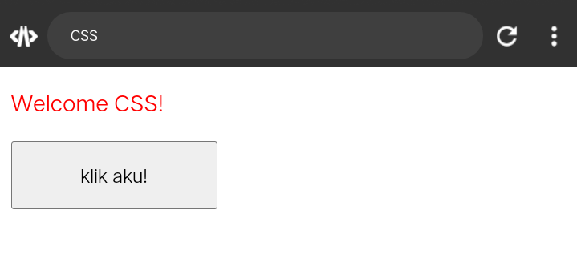

# Percobaan kedua CSS
## Kode CSS
```css
button {
        width: 150px;
        height: 50px;
        font-size: 20px;
        color: green;
        font-weight: bold;
      }
```
## Font-Size
### Before

### After

> [!note] Penjelasan
> >omaga
## Color
### Before

### After

> [!note] Penjelasan
> > Omaga
## Font-Weigth
### Before

### After

> [!note] Penjelasan
> > Omaga
