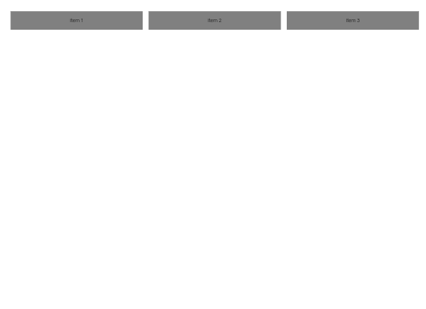
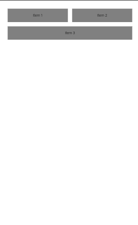
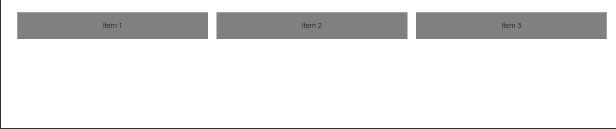
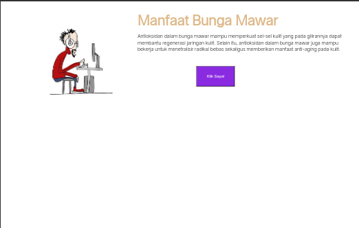
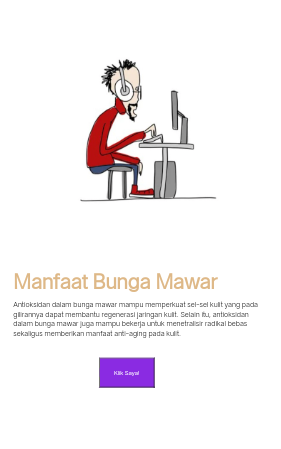

Nama materi :
Width dan Height


Nama kelompok :
- Muh Fathurrahman.P
- Muhammad Agis 


Kelas :
XI RPL 1


# **Fungsi Width dan Height**
`width` dan `height` adalah properti CSS yang digunakan untuk mengatur lebar dan tinggi sebuah elemen HTML seperti gambar atau konten lainnya. Properti `width` mengontrol lebar elemen, sementara properti `height` mengontrol tingginya. Dengan menggunakan properti ini, Anda dapat secara fleksibel mengatur ukuran elemen sesuai kebutuhan tata letak dan desain halaman web.
`max-width` dan `min-width` adalah dua properti CSS yang digunakan untuk mengontrol lebar elemen dalam desain responsif.
`max-height` dan `min-height` adalah properti CSS yang mirip dengan `max-width` dan `min-width`, tetapi untuk mengontrol tinggi elemen.

# **Properti**
## width 
### Penjelasan

Mengontrol lebar elemen.
### Kode Program
```css
button {    
         height:100px;
        }
```

### Hasil


## height 
### Penjelasan

mengontrol tinggi sebuah elemen sebanyak 100px.

### Kode program
```css
button {
            height:100px;
        }
```

### Hasil


## Max-width
### Penjelasan
 menetapkan lebar maksimum untuk sebuah elemen. Elemen tidak akan pernah melebihi lebar ini, bahkan jika lebar konten di dalamnya melebihi nilai yang ditetapkan.

### Kode Program
```css
 .container {
  display: flex;
  flex-wrap: wrap;
  max-width: 600px;
  margin: 0 auto; 
  padding: 20px;
}

.item {
  flex: 1 1 200px; 
  background-color: gray;
  margin: 10px;
  padding: 20px;
  text-align: center;
}
```
  

### Hasil
#### Before Hp

#### After Hp
 
## Min-width
### Penjelasan
Properti `min-width` menetapkan lebar minimum untuk sebuah elemen. Elemen akan memiliki setidaknya lebar ini, bahkan jika konten di dalamnya tidak memerlukan itu.
### Kode Program
```css
.container {
  display: flex;
  flex-wrap: wrap;
  min-width: 600px;
  margin: 0 auto;
  padding: 20px;
}

.item {
  flex: 1 1 200px;
  background-color: gray;
  margin: 10px;
  padding: 20px;
  text-align: center;
}
```
### Hasil
#### Before Laptop

#### After Hp

## Max-height
### Penjelasan

Properti `max-height` menetapkan tinggi maksimum untuk sebuah elemen. Elemen tidak akan pernah melebihi tinggi ini, bahkan jika konten di dalamnya memerlukan lebih banyak ruang.
### Kode Program
```css
.container {
  display: flex;
  flex-wrap: wrap;
  margin: 0 auto;
  padding: 20px;
}

.item {
  flex: 1 1 200px;
  background-color: gray;
  margin: 10px;
  padding: 20px;
  text-align: center;
}
@media screen and (max-height: 500px) {
    .container {
        width: 100px;
        justify-content: column;
    }

}
```
### Hasil

#### Before Laptop 

#### After Hp

## Min-height
### Penjelasan

Properti `min-height` menetapkan tinggi minimum untuk sebuah elemen. Elemen akan memiliki setidaknya tinggi ini, bahkan jika konten di dalamnya tidak memerlukan itu.

### Kode Program

```css
.container {
  display: flex;
  flex-wrap: wrap;
  margin: 0 auto;
  padding: 20px;
}

.item {
  flex: 1 1 200px;
  background-color: gray;
  margin: 10px;
  padding: 20px;
  text-align: center;
}
@media screen and (min-height: 500px) {
    .container {
        width: 100px;
        justify-content: column;
    }

}
```

### Hasil
#### Before Laptop 
 
#### After Hp

# **Value**
- Piksel (`px`): Contohnya, `width: 200px;` atau `height: 100px;` akan mengatur lebar elemen menjadi 200 piksel dan tinggi menjadi 100 piksel.

- Persentase (`%`): Contohnya, `width: 50%;` atau `height: 75%;` akan mengatur lebar atau tinggi elemen menjadi setengah atau tiga perempat dari lebar atau tinggi elemen induknya.

- `Em` (em): `Em` adalah unit yang relatif terhadap ukuran font elemen yang diatur. Misalnya, `width: 2em;` akan mengatur lebar elemen menjadi dua kali ukuran font elemen yang diterapkan padanya.

- Viewport unit (`vw` dan `vh`): Unit `vw` (viewport width) dan `vh` (viewport height) mengukur ukuran relatif terhadap lebar atau tinggi viewport browser pengguna. Misalnya, `width: 50vw;` akan mengatur lebar elemen menjadi setengah dari lebar viewport.

- Auto: Jika Anda mengatur `width` atau `height` menjadi auto, browser akan menghitung lebar atau tinggi elemen secara otomatis berdasarkan konten di dalamnya atau berdasarkan aturan layout yang diberikan.


# Implementasi

```html
<!DOCTYPE html>
<html>
<head>
    <title>Belajar Di Rumah aja</title>
    <style>
     body {
    margin: 0px;
    padding: 0px;
    font-family: 'Open Sans',sans-serif;
}

.container {
    width: 1100px;
    margin: auto;
    position: relative;
    max-width: 1170px;
}

section {
    margin: auto;
    display: flex;
    margin-bottom: 50px;
}

h2 {
    font-family: 'comic sans ms';
    font-weight: 800;
    font-size: 45px;
    margin-bottom: 20px;
    color: burlywood;
    width: 100%;
    line-height: 50px;
}

img {
    width: 500px;
    height:400px;
}
button {
  width: 130px;
  height: 70px;
  background-color: blueviolet;
  color: white;
  margin-left: 200px;
  margin-top: 30px;
}

@media screen and (max-width: 780px) {
    .container {
        width: 90%;
    }

    section {
        display: block;
    }

    img {
        display: block;
        width: 100%;
        height: auto;
    }
}
    </style>
</head>
<body>
    <div class="container">
        <section id="home">
            
            <div class="kolom">
                <h2>Manfaat Bunga Mawar</h2>
                <p>Antioksidan dalam bunga mawar mampu memperkuat sel-sel kulit yang pada gilirannya dapat membantu regenerasi jaringan kulit. Selain itu, antioksidan dalam bunga mawar juga mampu bekerja untuk menetralisir radikal bebas sekaligus memberikan manfaat anti-aging pada kulit.</p>
            <button>Klik Saya!</button>
            </div>
        </section>
</div>
</body>  
</html>
```


## Hasil
### Before Laptop

### After Hp

## **Penjelasan program:**


- `body`: Mengatur `margin`, `padding`, dan `font family` untuk seluruh halaman web.

- `.container`: Mendefinisikan sebuah kontainer dengan lebar maksimum `1100px` yang akan ditengahkan secara otomatis di tengah halaman. Maksimum lebarnya dibatasi hingga `1170px`.

- `section`: Mengatur tata letak bagian-bagian (sections) dalam halaman dengan menggunakan flexbox.

- `h2`: Mengatur gaya teks untuk judul level 2 dengan font `'comic sans ms'`, tebal, dan warna `burlywood`.

- ` img { }` Adalah untuk mengatur lebar dan tingginya gambar.lebarnya adalah `500px`,dan Tingginya adalah `400px`.

- `@media screen and (max-width: 780px)`: Mendefinisikan aturan tata letak responsif untuk layar dengan lebar maksimum `780px`. Ketika lebar layar mencapai nilai tersebut, kontainer akan menyesuaikan lebarnya menjadi 90%, bagian `section` akan menggunakan tata letak blok (block layout), dan gambar akan menyesuaikan lebar sesuai dengan lebar layar dengan menjaga rasio aspeknya.


