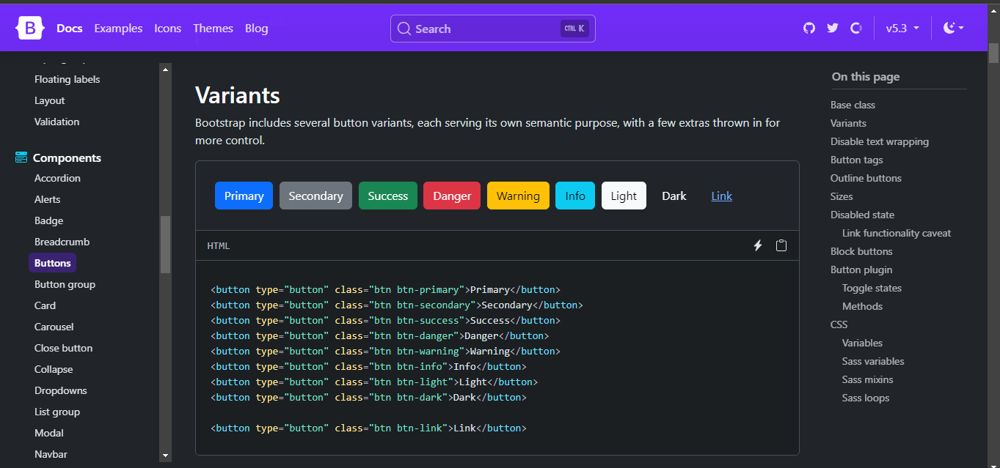

# Penggunaan Boostrap

## Instalasi Bootstrap secara Online /  CDN

sekarang kita akan menjelaskan bagaimana cara menginstall bootstrap secara online. Berikut langkah-langkahnya:

1. Masuklah ke website resmi Bootstrap dengan mengunjungi situs web resmi di [https://getbootstrap.com/](https://getbootstrap.com/).
2. Di laman utama web Bootstrap, scroll kebawah sampai ketemu Incluce via CDN, kita akan melihat kode yang dapat kita gunakan untuk menghubungkan website kita yang mau diterapkan Bootstrap.

3. Klik tombol "Copy" untuk menyalin seluruh kode tersebut.
4. Buatlah file baru dengan nama index.html atau nama yang kita inginkan menggunakan teks editor atau editor HTML yang kita biasa pakai.
5. Tempelkan(paste) kode yang telah kita salin dari langkah sebelumnya ke dalam file html yang baru kita buat. dengan menempelkan kode tersebut maka bootstrap kita sudah terhubung namun harus secara online.

6. kita dapat mulai memberikan gaya pada tag-tag atau elemen dalam file HTML tersebut dengan menggunakan kelas-kelas Bootstrap.

---
## Instalasi Bootstrap secara lokal

Untuk menginstal Bootstrap secara offline, kita perlu mengunduh file Bootstrap dan menyimpannya di folder proyek kita. Berikut adalah langkah-langkah untuk menginstal Bootstrap secara offline:

1. **Unduh File Bootstrap:** Kunjungi situs web resmi Bootstrap di [https://getbootstrap.com/](https://getbootstrap.com/)  dan cari tautan unduhan untuk versi Bootstrap yang diinginkan.

2. **Ekstrak File Bootstrap:** Setelah mengunduh file ZIP Bootstrap, temukan file tersebut di komputer kita dan ekstrak isi file ZIP ke folder proyek kita.Setelah diekstrak, kita akan memiliki folder Bootstrap yang berisi berkas-berkas Bootstrap yang diperlukan.

3. **Hubungkan Berkas Bootstrap pada Halaman HTML:** Buka file HTML proyek kita menggunakan teks editor atau editor HTML yang biasa kita gunakan. Di dalam tag pada halaman HTML , tambahkan tautan ke berkas CSS Bootstrap dan skrip JavaScript Bootstrap. Gunakan tag link di dalam tag head untuk tautan CSS dan tag script di dalam tag body untuk javascript. Berikut contoh tautan yang umum di bootstrap:

4. kita dapat mulai memberikan gaya pada tag-tag atau elemen dalam file HTML tersebut dengan menggunakan kelas-kelas Bootstrap.

---
## Penggunaan komponen dan lain-lain di bootstrap

1. Masuklah ke website resmi Bootstrap dengan mengunjungi situs web resmi di [https://getbootstrap.com/](https://getbootstrap.com/).
2. Di laman utama web Bootstrap, di kiri atas pada web bootstrap klick "Docs" untuk mengetahui apa saja komponen atau contet dan lain-lain pada bootstrap, kalian bisa memilih apa saja yg perdapat pada komponen dan lain-lain pada bootstrap.

contoh pada button, kalian bebas memilih apa saja pada komponen button yang ada di bootstrap

---
## Membuat tampilan web dasar Menggunakan Bootstrap

### Code
```html
<!DOCTYPE html>

<html lang="en">

<head>

  <meta charset="UTF-8">

  <meta name="viewport" content="width=device-width, initial-scale=1.0">

  <title>Contoh Web dengan Bootstrap</title>

  <!-- Memasukkan Bootstrap CSS -->

  <link rel="stylesheet" href="https://stackpath.bootstrapcdn.com/bootstrap/4.5.2/css/bootstrap.min.css" integrity="sha384-JcKb8q3iqJ61gNV9KGb8thSsNjpSL0n8PARn9HuZOnIxN0hoP+VmmDGMN5t9UJ0Z" crossorigin="anonymous">

</head>

<body>

  

  <div class="container">

    <!-- Navbar -->

    <nav class="navbar navbar-expand-lg navbar-light bg-light">

      <a class="navbar-brand" href="#">Navbar</a>

      <button class="navbar-toggler" type="button" data-toggle="collapse" data-target="#navbarSupportedContent" aria-controls="navbarSupportedContent" aria-expanded="false" aria-label="Toggle navigation">

        <span class="navbar-toggler-icon"></span>

      </button>

  

      <div class="collapse navbar-collapse" id="navbarSupportedContent">

        <ul class="navbar-nav mr-auto">

          <li class="nav-item active">

            <a class="nav-link" href="#">Home <span class="sr-only">(current)</span></a>

          </li>

          <li class="nav-item">

            <a class="nav-link" href="#">Link</a>

          </li>

          <li class="nav-item">

            <a class="nav-link disabled" href="#" tabindex="-1" aria-disabled="true">Disabled</a>

          </li>

        </ul>

        <form class="form-inline my-2 my-lg-0">

          <input class="form-control mr-sm-2" type="search" placeholder="Search" aria-label="Search">

          <button class="btn btn-outline-success my-2 my-sm-0" type="submit">Search</button>

        </form>

      </div>

    </nav>

  

    <!-- Isi Konten -->

    <div class="jumbotron mt-3">

      <h1 class="display-4">Hello, Orang</h1>

      <p class="lead">Ini tampilan web yang sangat sederhana sekali menggunakan bootstrap. </p>

      <hr class="my-4">

      <p>Jika ingin lebih lanjut seputar ... klik dibawah</p>

      <a class="btn btn-primary btn-lg" href="#" role="button">klik disini!</a>

    </div>

  </div>

  
  

</body>

</html>
```

### Hasil


### Penjelasan

- `<!DOCTYPE html>`: Mendefinisikan dokumen sebagai dokumen HTML5.
- `<html lang="en">`: Mulai dari tag `<html>` dengan atribut `lang="en"` untuk menandakan bahasa dokumen (Inggris).
- `<head>`: Bagian kepala dokumen yang berisi metadata, seperti charset, viewport, judul halaman, dan referensi ke file eksternal (Bootstrap CSS).
- `<meta charset="UTF-8">`: Pengaturan karakter UTF-8 untuk encoding dokumen.
- `<meta name="viewport" content="width=device-width, initial-scale=1.0">`: Pengaturan viewport untuk responsifitas halaman pada perangkat dengan lebar layar yang berbeda.
- `<title>Contoh Web dengan Bootstrap</title>`: Judul halaman web.
- `<div class="container">`: Menggunakan kelas Bootstrap `container` untuk membatasi konten agar terpusat dan responsif.
- **Navbar** (`<nav class="navbar ...">`): Navigasi atas dengan logo, tombol toggler untuk tampilan layar kecil, dan daftar menu.
    - `<a class="navbar-brand" href="#">Navbar</a>`: Judul atau logo navbar.
    - `<button class="navbar-toggler ...">`: Tombol untuk menyembunyikan/menampilkan menu di layar kecil.
    - `<div class="collapse navbar-collapse" ...>`: Daftar menu yang akan muncul ketika tombol toggler ditekan.
- **Isi Konten**:
    - `<div class="jumbotron ...">`: Bagian utama dengan judul besar, teks deskripsi, garis pemisah, dan tombol tindakan.
    - `<a class="btn btn-primary btn-lg" ...>`: Tombol dengan gaya Bootstrap untuk menambahkan aksi tindak lanjut.

### Kesimpulan

Program ini menunjukkan bagaimana menggunakan Bootstrap untuk membangun tata letak responsif dengan mudah, termasuk penggunaan komponen seperti navbar dan jumbotron. Bootstrap mempermudah pengembangan web dengan menyediakan kelas CSS yang sudah terdefinisi untuk tata letak dan komponen, sehingga menghemat waktu dalam desain dan pengembangan halaman web yang modern dan responsif.

---
