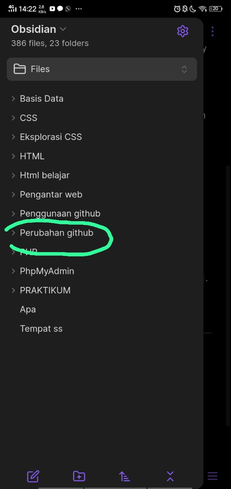
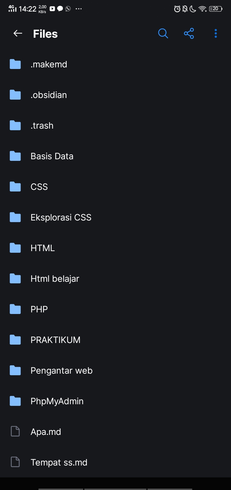

# Cara mengupload file di Github

1. Masuk ke termux
2. Ketik `pwd`
3. Ketik `cd storage`
4. Ketik `cd shared`
5. Cari file obsidian kalian dimana, lalu ketik `cd Obsidian`
6. Ketik `git status`. digunakan untuk menunjukkan status dari working directory dan staging area. Ini memberi tahu Anda tentang perubahan yang telah Anda buat, tetapi belum di-commit.
7. Lalu ketik `git add .`. digunakan untuk menambahkan semua perubahan di dalam working directory ke staging area.
8. Lalu ketik `git status`, buat melihat perubahan sebelumnya 
9. Ketik `git commit -m "(Isi terserah)"` . digunakan untuk membuat commit baru dengan pesan yang ditentukan di dalam tanda kutip.
10. Lalu ketik `git push origin master`.digunakan untuk mengirim (push) perubahan yang telah di-commit di branch `master` pada repository lokal ke repository remote yang bernama `origin`.
11. Masukkan nama github kalian dan masukkan password atau link key yang kalian sudah salin.
---
## Melakukan perubahan

### Yang akan diubah

Ini akan menampilkan perubahan pada github,terus lakukan untuk menggupload di github.
1. Masuk ke termux
2. Ketik `pwd`
3. Ketik `cd storage`
4. Ketik `cd shared`
5. Cari file obsidian kalian dimana, lalu ketik `cd Obsidian`
6. Ketik `git status`. digunakan untuk menunjukkan status dari working directory dan staging area. Ini memberi tahu Anda tentang perubahan yang telah Anda buat, tetapi belum di-commit.
7. Lalu ketik `git add .`. digunakan untuk menambahkan semua perubahan di dalam working directory ke staging area.
8. Lalu ketik `git status`, buat melihat perubahan sebelumnya 
9. Ketik `git commit -m "(Isi terserah)"` . digunakan untuk membuat commit baru dengan pesan yang ditentukan di dalam tanda kutip.
10. Lalu ketik `git push origin master`.digunakan untuk mengirim (push) perubahan yang telah di-commit di branch `master` pada repository lokal ke repository remote yang bernama `origin`.
11. Masukkan nama github kalian dan masukkan password atau link key yang kalian sudah salin.

### Perubahan

#### Before

#### After