# Pembuatan DataBase

## Query
```sql
CREATE DATABASE webkelas;
```

## PHPMyadmin

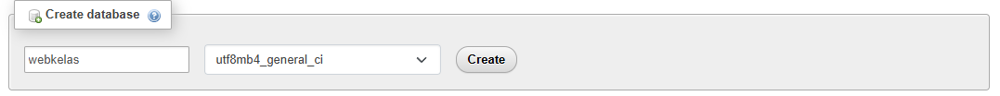

## Penjelasan

- `CREATE DATABASE`: Ini adalah perintah SQL yang digunakan untuk membuat sebuah basis data baru.
- `webkelas`: Ini adalah nama basis data yang akan dibuat. Anda dapat mengganti `webkelas` dengan nama lain sesuai kebutuhan aplikasi atau proyek Anda.

---
# Input Sturktur Database

## Siswa

### Query
```sql
CREATE TABLE `siswa` (
  `id` int(11) PRIMARY KEY NOT NULL,
  `nama` varchar(60) NOT NULL,
  `nis` int(11) NOT NULL,
  `nisn` int(11) NOT NULL,
  `alamat` varchar(60) NOT NULL,
  `tgl_lahir` date NOT NULL,
  `id_kelas` int(11) NOT NULL
)
```

### PHPMyAdmin

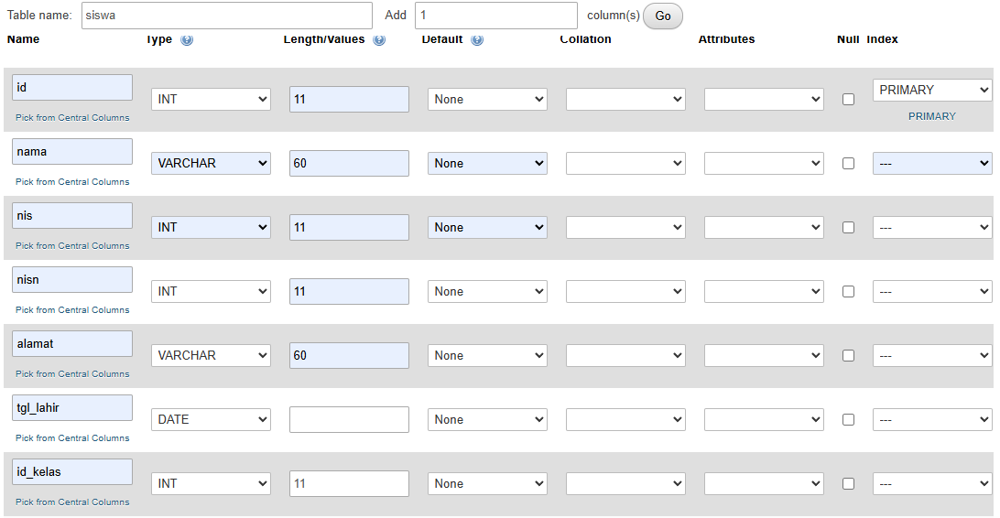

### Struktur

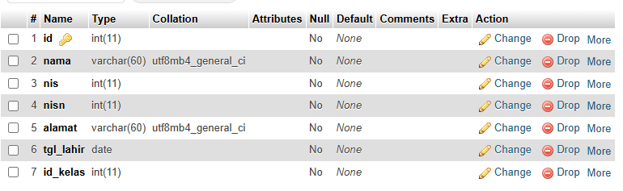

### Penjelasan

- **`id` int(11) PRIMARY KEY NOT NULL**: Kolom `id` adalah tipe data integer (bilangan bulat) dengan panjang maksimum 11 digit. Kata kunci `PRIMARY KEY` menandakan bahwa kolom ini adalah kunci utama yang unik untuk setiap baris di tabel. Kata kunci `NOT NULL` menunjukkan bahwa kolom ini tidak boleh kosong (tidak boleh null), artinya setiap baris harus memiliki nilai untuk kolom `id`.
- **`nama` varchar(60) NOT NULL**: Kolom `nama` adalah tipe data varchar (teks dengan panjang variabel) dengan panjang maksimum 60 karakter. Kata kunci `NOT NULL` menandakan bahwa kolom ini juga tidak boleh kosong, sehingga setiap baris harus memiliki nilai untuk kolom `nama`.
- **`nis` int(11) NOT NULL**: Kolom `nis` adalah tipe data integer dengan panjang maksimum 11 digit dan tidak boleh kosong. `nis` biasanya digunakan untuk Nomor Induk Siswa di sekolah.
- **`nisn` int(11) NOT NULL**: Kolom `nisn` adalah tipe data integer dengan panjang maksimum 11 digit dan tidak boleh kosong. `nisn` biasanya digunakan untuk Nomor Induk Siswa Nasional.
- **`alamat` varchar(60) NOT NULL**: Kolom `alamat` adalah tipe data varchar dengan panjang maksimum 60 karakter dan tidak boleh kosong. Ini digunakan untuk menyimpan alamat siswa.
- **`tgl_lahir` date NOT NULL**: Kolom `tgl_lahir` adalah tipe data date (tanggal) dan tidak boleh kosong. Digunakan untuk menyimpan tanggal lahir siswa.
- **`id_kelas` int(11) NOT NULL**: Kolom `id_kelas` adalah tipe data integer dengan panjang maksimum 11 digit dan tidak boleh kosong. Ini adalah kunci asing yang merujuk ke tabel lain (misalnya `kelas`), menunjukkan kelas mana tempat siswa tersebut terdaftar.

---
## Curhat

### Query
```sql
CREATE TABLE `curhat` (
  `id` int(11) PRIMARY KEY NOT NULL,
  `curhat_text` text NOT NULL,
  `response_text` text NOT NULL,
  `siswa_id` int(11) NOT NULL
)
```

### PHPMyAdmin

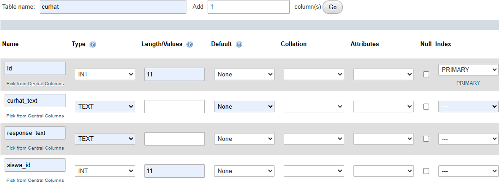

### Struktur

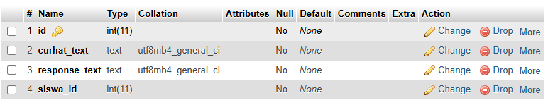

### Penjelasan

- **`id` int(11) PRIMARY KEY NOT NULL**: Kolom `id` adalah tipe data integer (bilangan bulat) dengan panjang maksimum 11 digit. Kata kunci `PRIMARY KEY` menandakan bahwa kolom ini adalah kunci utama yang unik untuk setiap baris di tabel. Kata kunci `NOT NULL` menunjukkan bahwa kolom ini tidak boleh kosong (tidak boleh null), artinya setiap baris harus memiliki nilai untuk kolom `id`.
- **`curhat_text` text NOT NULL**: Kolom `curhat_text` adalah tipe data `text` yang digunakan untuk menyimpan teks curhatan dari siswa. Tipe data `text` cocok untuk menyimpan teks panjang yang bisa sangat bervariasi dalam panjangnya. Kata kunci `NOT NULL` menunjukkan bahwa kolom ini harus diisi, tidak boleh kosong.
- **`response_text` text NOT NULL**: Kolom `response_text` adalah tipe data `text` yang digunakan untuk menyimpan teks tanggapan dari pihak yang menanggapi curhatan siswa. Ini juga menggunakan tipe data `text` karena tanggapan juga bisa berupa teks panjang. Kata kunci `NOT NULL` menunjukkan bahwa kolom ini harus diisi, tidak boleh kosong.
- **`siswa_id` int(11) NOT NULL**: Kolom `siswa_id` adalah tipe data integer dengan panjang maksimum 11 digit dan tidak boleh kosong. Ini adalah kunci asing yang merujuk ke tabel `siswa`, menunjukkan siswa mana yang mengirimkan curhatan ini.

---
# Input Nilai

## Siswa

### Query
```sql
INSERT INTO `siswa` (`id`, `nama`, `nis`, `nisn`, `alamat`, `tgl_lahir`, `id_kelas`) VALUES
('1', 'Muhammad Agis', '22370', '0078335217', 'Jl. Galangan Kapal Permaindian 1', '2007-07-11', '1');
```

### PHPMyAdmin

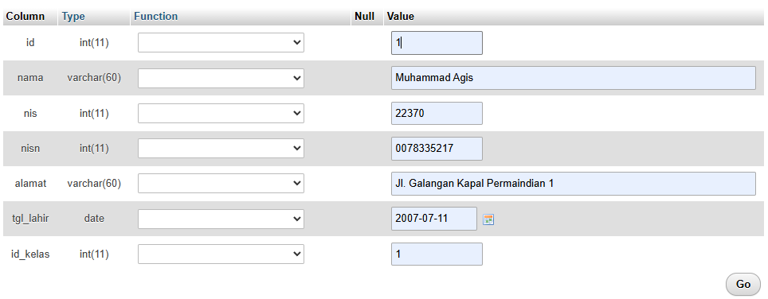

### Data Table

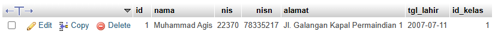

### Penjelasan

- `id`: Nilai yang dimasukkan adalah `1`. Ini menandakan ID unik untuk siswa.
- `nama`: Nilai yang dimasukkan adalah `Muhammad Agis`. Ini adalah nama lengkap siswa.
- `nis`: Nilai yang dimasukkan adalah `22370`. NIS (Nomor Induk Siswa) adalah nomor identifikasi unik untuk siswa di sekolah.
- `nisn`: Nilai yang dimasukkan adalah `0078335217`. NISN (Nomor Induk Siswa Nasional) adalah nomor identifikasi nasional untuk siswa.
- `alamat`: Nilai yang dimasukkan adalah `Jl. Galangan Kapal Permaindian 1`. Ini adalah alamat tempat tinggal siswa.
- `tgl_lahir`: Nilai yang dimasukkan adalah `2007-07-11`. Ini adalah tanggal lahir siswa, dengan format `YYYY-MM-DD`.
- `id_kelas`: Nilai yang dimasukkan adalah `1`. Ini adalah ID kelas tempat siswa tersebut terdaftar.

---
# Relasi

## Query
```sql
ALTER TABLE `curhat`
ADD CONSTRAINT `curhat_fk` FOREIGN KEY (`siswa_id`) REFERENCES `siswa` (`id`) ON DELETE CASCADE ON UPDATE CASCADE;
```

## PHPMyAdmin

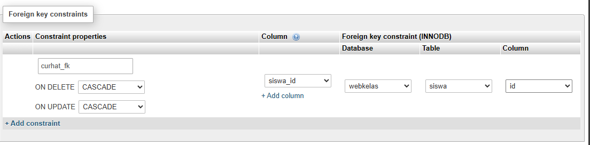

## Hasil Relasi

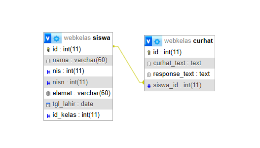

## Penjelasan

-  **ALTER TABLE `curhat`**: Ini adalah perintah SQL yang digunakan untuk mengubah struktur tabel `curhat`.
- **ADD CONSTRAINT `curhat_fk`**: Ini adalah bagian dari perintah yang menentukan nama untuk konstrain kunci asing yang akan ditambahkan. Dalam hal ini, nama konstrain kunci asing diberi nama `curhat_fk`.
-  **FOREIGN KEY (`siswa_id`)**: Ini menentukan bahwa kita akan menambahkan sebuah kunci asing ke kolom `siswa_id` di tabel `curhat`. Kunci asing ini akan merujuk ke kolom lain di tabel lain.
- **REFERENCES `siswa` (`id`)**: Ini menunjukkan bahwa kolom `siswa_id` dalam tabel `curhat` akan merujuk ke kolom `id` dalam tabel `siswa`. Dengan kata lain, setiap nilai dalam kolom `curhat.siswa_id` harus sesuai dengan nilai yang ada dalam kolom `siswa.id`.
- **ON DELETE CASCADE**: Opsi ini menunjukkan apa yang harus dilakukan saat baris yang terkait di tabel utama (`siswa`) dihapus. `CASCADE` berarti jika baris yang sesuai di tabel `siswa` dihapus, maka semua baris yang terkait di tabel `curhat` juga akan dihapus. Dalam konteks ini, jika sebuah siswa dihapus dari tabel `siswa`, semua catatan `curhat` yang terkait dengan siswa itu juga akan dihapus.
- **ON UPDATE CASCADE**: Opsi ini menunjukkan apa yang harus dilakukan saat nilai kunci primer di tabel utama (`siswa.id`) diperbarui. `CASCADE` berarti jika nilai `id` dari siswa diubah, maka nilai `siswa_id` dari semua baris yang terkait di tabel `curhat` juga akan diperbarui sesuai dengan nilai `id` yang baru.

---

# Relasi PHP

## Koneksi PHP dan PHPMyAdmin

### Code
```php
<!-- db.php -->

  

<?php

$servername = "localhost";

$username = "root";

$password = "";

$dbname = "webkelas";

  

$koneksi = new mysqli($servername, $username, $password, $dbname);

  

// if ($koneksi) {

//     echo "<br> koneksi aman <br>";

// } else {

//     echo "error, tidak bisa koneksi ke database";

// }

  

?>
```

### Penjelasan

- `$servername`: Ini adalah nama server database. Dalam contoh ini, server database berjalan di localhost, yang berarti server database berjalan pada komputer yang sama dengan aplikasi PHP Anda.
- `$username`: Ini adalah nama pengguna untuk mengakses database. Dalam contoh ini, pengguna MySQL adalah "root".
- `$password`: Ini adalah kata sandi untuk pengguna MySQL. Dalam contoh ini, tidak ada kata sandi yang ditetapkan (kosong). Ini umumnya tidak disarankan untuk penggunaan produksi karena masalah keamanan.
- `$dbname`: Ini adalah nama database yang akan digunakan untuk koneksi. Dalam contoh ini, database yang digunakan adalah "webkelas".
- Baris ini membuat objek koneksi menggunakan kelas `mysqli` (mysqli merupakan salah satu ekstensi PHP untuk mengakses database MySQL).
- Parameter pertama adalah `$servername` (nama server), kedua adalah `$username` (nama pengguna), ketiga adalah `$password` (kata sandi), dan keempat adalah `$dbname` (nama database).
- Objek koneksi ini disimpan dalam variabel `$koneksi`, yang nantinya akan digunakan untuk melakukan operasi-operasi database seperti pengambilan data, penyisipan data, dan lainnya.

---
## Menambhakan Curhat

### Code
```php
<!-- // add_curhat.php -->

  

<?php

session_start();

require_once ('db.php');

  
  
  

$success = "";

$error = "";

if ($_SERVER["REQUEST_METHOD"] == "POST") {

    $curhat_text = $_POST['curhat_text'];

    $siswa_id = $_SESSION['user']['id'];

  

    $sql = "INSERT INTO curhat (curhat_text, siswa_id) VALUES ('$curhat_text', '$siswa_id')";

    if ($koneksi->query($sql) === TRUE) {

        $success = "Curhat baru berhasil dibuat";

        echo "<script>

            setTimeout(() => {

                window.location.href = 'view_curhat.php';

            }, 1000);

            </script>";

    } else {

        $error = "Error: " . $sql . "<br>" . $koneksi->error;

    }

}

?>

  

<!DOCTYPE html>

<html :class="{ 'theme-dark': false }" x-data="data()" lang="en">

  

<head>

    <title>Dashboard Siswa</title>

    <?php require_once './views/header.php'; ?>

    <style>

        .njj {

            margin: 0 6px;

        }

    </style>

</head>

  

<body>

    <div class="flex h-screen bg-gray-50 dark:bg-gray-900" :class="{ 'overflow-hidden': isSideMenuOpen }">

  

        <?php require_once './views/sidebar.php'; ?>

        <div class="flex flex-col flex-1 w-full">

            <?php require_once './views/navbar.php'; ?>

  

            <main class="h-full pb-16 overflow-y-auto">

                <div class="container grid px-6 mx-auto">

                    <h2 class="my-6 text-2xl font-semibold text-gray-700 dark:text-gray-200">

                        Halaman Ingin Curhat

                    </h2>

                    </h2>

                    <?php if (!empty($success)): ?>

                            <div class="alert success mb-4 rounded">

                                <span class="closebtn" onclick="this.parentElement.style.display='none';">&times;</span>

                                <strong>Sukses!</strong> <?= $success ?>

                            </div>

                    <?php endif; ?>

                    <?php if (!empty($error)): ?>

                            <div class="alert error mb-4 rounded">

                                <span class="closebtn" onclick="this.parentElement.style.display='none';">&times;</span>

                                <strong>Gagal!</strong> <?= $error ?>

                            </div>

                    <?php endif; ?>

                    <form method="post" action="">

                        <div class="py-3">

                            <p class="py-3"><label for="" class="font-bold dark:text-gray-100">Curhat

                                    Text:</label></p>

                            <textarea style="border: 2px solid rgba(0,0,0,.5)" class="text-lg p-3 w-full rounded"

                                name="curhat_text" rows="5"></textarea>

                        </div>

  

                        <button type="submit" class="bg-blue-600 text-white p-2 rounded">Tambah Curhat</button>

                    </form>

  

                </div>

            </main>

        </div>

    </div>

  
  

</body>

  

</html>
```

### Tabel Curhat
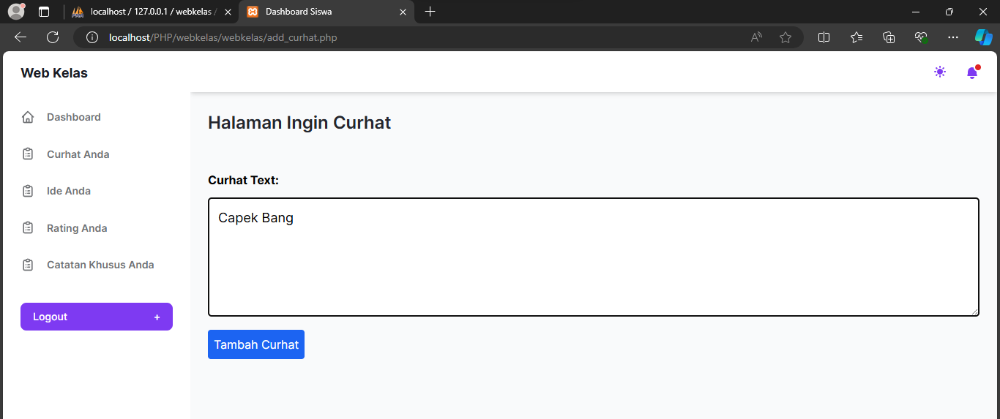

### Penjelasan

- `session_start()` digunakan untuk memulai sesi PHP, yang penting untuk mengakses dan menyimpan data sesi seperti informasi pengguna yang sedang login.
- `require_once ('db.php');` digunakan untuk menyertakan file `db.php` yang telah Anda buat sebelumnya, yang berisi informasi koneksi ke database.
- Variabel `$success` dan `$error` digunakan untuk menyimpan pesan yang akan ditampilkan kepada pengguna terkait status operasi (sukses atau gagal) ketika menambahkan curhatan.
-  Kode ini menangani proses saat form dikirim (metode POST).
- `$curhat_text` diambil dari `$_POST['curhat_text']`, yang merupakan teks curhatan yang diinputkan oleh pengguna melalui form.
- `$siswa_id` diambil dari `$_SESSION['user']['id']`, yang merupakan id siswa yang sedang login, disimpan dalam session sebelumnya.
- Dilakukan query SQL untuk menyimpan data curhatan baru ke dalam tabel `curhat` menggunakan perintah `INSERT`.
- Jika query berhasil (`$koneksi->query($sql) === TRUE`), maka `$success` akan diisi dengan pesan sukses, dan pengguna akan diarahkan ke halaman `view_curhat.php` setelah 1 detik.
- Jika query gagal, maka `$error` akan berisi pesan kesalahan yang diambil dari `$koneksi->error`.
- - Terdapat HTML untuk menampilkan halaman web kepada pengguna.
- Form dibuat dengan metode POST yang mengarahkan action ke halaman itu sendiri (`action=""`).
- Terdapat penanganan untuk menampilkan pesan sukses (`$success`) dan pesan error (`$error`) jika ada.
- Pesan sukses dan error ditampilkan menggunakan HTML dengan menggunakan PHP untuk memeriksa apakah variabel `$success` atau `$error` kosong sebelum menampilkannya.
- JavaScript digunakan untuk mengarahkan pengguna ke halaman `view_curhat.php` setelah 1 detik menggunakan `setTimeout`.

---
## Melihat hasil curhat

### Code
```php
<!-- admin_dashboard.php -->

<?php

session_start();

?>

  

<!DOCTYPE html>

<html :class="{ 'theme-dark': false }" x-data="data()" lang="en">

  

<head>

    <title>Dashboard Admin</title>

    <?php require_once './views/header.php'; ?>

    <style>

        .njj {

            margin: 0 6px;

        }

    </style>

</head>

  

<body>

    <div class="flex h-screen bg-gray-50 dark:bg-gray-900" :class="{ 'overflow-hidden': isSideMenuOpen }">

  

        <?php require_once './views/sidebar.php'; ?>

        <div class="flex flex-col flex-1 w-full">

            <?php require_once './views/navbar.php'; ?>

            <?php require_once 'fungsi.php'; ?>

  

            <main class="h-full pb-16 overflow-y-auto">

                <div class="container grid px-6 mx-auto">

                    <h2 class="my-6 text-2xl font-semibold text-gray-700 dark:text-gray-200">

                        Tabel Data Curhat Siswa

                    </h2>

  

                    <?php if ($_SESSION['role'] == 'siswa'): ?>

                        <div class="flex text-sm font-semibold mb-4 align-center justify-end">

                            <a class="rounded bg-blue-600 text-white p-2 njj" href="add_curhat.php">Ingin Curhat</a><br>

  

                        </div>

                    <?php endif; ?>

  

                    <!-- With actions -->

                    <div class="w-full overflow-hidden rounded-lg shadow-xs">

                        <div class="w-full overflow-x-auto">

                            <table class="w-full whitespace-no-wrap">

                                <thead>

                                    <tr

                                        class="text-xs font-semibold tracking-wide text-left text-gray-500 uppercase border-b dark:border-gray-700 bg-gray-50 dark:text-gray-400 dark:bg-gray-800">

                                        <th class="px-4 py-3">id</th>

                                        <th class="px-4 py-3">curhat</th>

                                        <th class="px-4 py-3">respon</th>

                                        <th class="px-4 py-3">siswa</th>

                                    </tr>

                                </thead>

                                <tbody class="bg-white divide-y dark:divide-gray-700 dark:bg-gray-800">

                                    <?php

                                    require_once "db.php";

                                    $i = 1;

                                    if ($_SESSION['role'] == 'siswa') {

                                        $query = mysqli_query($koneksi, "SELECT c.curhat_text as 'curhat_text',

                                                                    s.nama as 'siswa',

                                                                    s.id as 'siswa_id',

                                                                    c.id as 'id',

                                                                    c.response_text as 'response_text'

                                                                    FROM

                                                                    curhat as c

                                                                    INNER JOIN

                                                                    siswa as s

                                                                    ON c.siswa_id = s.id

                                                                    WHERE s.id = {$_SESSION['user']['id']};

                                                                    ");

                                    } else {

                                        $query = mysqli_query($koneksi, "SELECT c.curhat_text as 'curhat_text',

                                                                    s.nama as 'siswa',

                                        s.id as 'siswa_id',

                                        c.id as 'id',

                                                                    c.response_text as 'response_text'

                                                                    FROM

                                                                    curhat as c

                                                                    INNER JOIN

                                                                    siswa as s

                                                                    ON c.siswa_id = s.id;

                                                                    ");

                                    }

                                    while ($data = mysqli_fetch_array($query)) {

                                        ?>

                                        <tr class="text-gray-700 dark:text-gray-400">

                                            <td class="px-4 py-3">

                                                <?= $i ?>

                                            </td>

                                            <td class="px-4 py-3 text-sm">

                                                <?= $data['curhat_text'] ?>

                                            </td>

                                            <td class="px-4 py-3 text-xs">

                                                <?php if (empty($data['response_text'])): ?>

                                                    <div class="flex text-sm font-semibold mb-4 align-center justify-end">

                                                        <a class="rounded bg-blue-600 text-white p-2 njj"

                                                            href="respon_curhat.php?id=<?= $data['id'] ?>&id_siswa=<?= $data['siswa_id'] ?>">Beri

                                                            Respon</a><br>

  

                                                    </div> <?php else: ?>

                                                    <?= $data['response_text'] ?>

                                                <?php endif; ?>

  

                                            </td>

                                            <td class="px-4 py-3 text-sm">

                                                <?= $data['siswa'] ?>

                                            </td>

                                        </tr>

                                        <?php

                                        $i++;

                                    }

                                    ?>

  

                                </tbody>

                            </table>

                        </div>

  

                    </div>

                </div>

            </main>

        </div>

    </div>

</body>

  

</html>
```

### Hasil Curhat
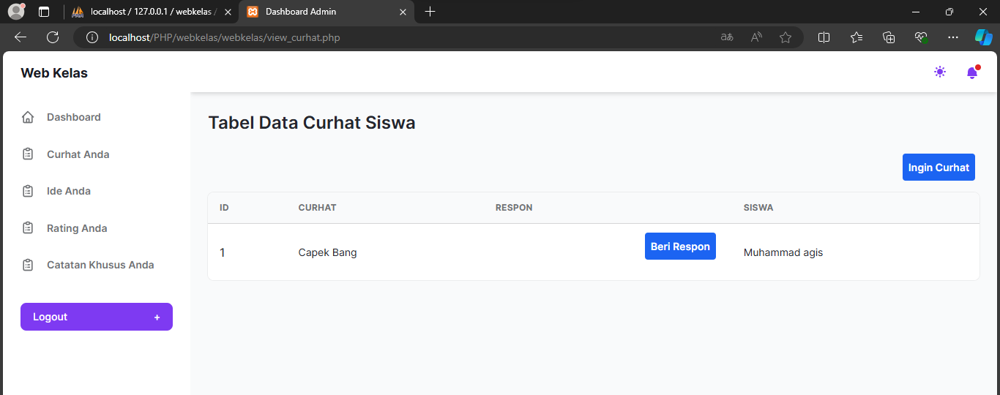

### Penjelasan

- `session_start();` memulai sesi PHP untuk mengakses dan menyimpan data sesi, seperti informasi pengguna yang sedang login dan peran (role) pengguna.
-  `<!DOCTYPE html>` dan `<html ...>` merupakan struktur dasar HTML.
- `<?php require_once './views/header.php'; ?>` digunakan untuk menyertakan file `header.php`, yang kemungkinan berisi pengaturan-pengaturan CSS, JavaScript, dan elemen header lainnya untuk halaman ini.
-  Halaman ini menggunakan struktur fleksibel (flex) untuk layout.
- `require_once './views/sidebar.php';` dan `require_once './views/navbar.php';` digunakan untuk menyertakan sidebar dan navbar dari file terpisah untuk memudahkan pengelolaan dan pemeliharaan kode.
- `require_once 'fungsi.php';` kemungkinan menyertakan file `fungsi.php` yang mungkin berisi fungsi-fungsi bantuan atau pengaturan tambahan.
- Bagian `main` digunakan untuk menampilkan konten utama, yang meliputi tabel untuk menampilkan data curhat siswa.
- Penggunaan PHP di dalam HTML (`<?php ... ?>`) digunakan untuk menyesuaikan tampilan berdasarkan peran pengguna (`$_SESSION['role']`) dan menampilkan data curhat siswa dari database.
- Dalam tabel, data curhat siswa diambil dari tabel `curhat` dan `siswa` dalam database menggunakan kueri SQL. Data ini ditampilkan dalam bentuk baris-baris tabel dengan menggunakan perulangan `while` untuk setiap hasil yang diperoleh dari kueri.
- Jika belum ada respon untuk curhatan tertentu, akan ditampilkan tombol "Beri Respon" yang mengarahkan pengguna ke halaman `respon_curhat.php` untuk memberikan respon.
- Jika sudah ada respon, respon tersebut akan langsung ditampilkan di kolom respon.
---
